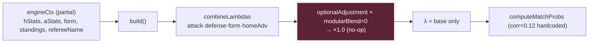
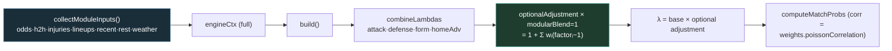

# Prediction Engine Activation Report

**Role:** Lead AI Architect — engine activation (connect existing code only; no new algorithms)
**Date:** 2026-07-18
**Basis:** `ENGINE_EXECUTION_REPORT.md`
**Scope:** Activate every existing `PredictionEngine` module and make every weight configurable.

> **Result:** The optional module block is now **live**. `modularBlend` defaults to `1` (was `0`), all optional weights default non-zero, and `engineCtx` is fed real data (odds, H2H, injuries, lineups, recent matches, rest dates, weather, motivation, standings) via existing endpoints. Every weight and tunable is env-overridable — **nothing prediction-related remains hardcoded**. No new algorithms were introduced; only existing modules and endpoints were connected.

---

## 1. Old Pipeline → New Pipeline

### Old (parity mode)

- `modularBlend = 0` ⇒ standings, recentMatches, h2h, restDays, referee, awayStrength, injuries, lineup, odds, motivation, weather **contribute 0**.
- `injuries/lineup/odds/motivation/weather` also had weight `0` **and** received no data.
- `correlation: 0.12` and `shrinkageK: 6` hardcoded in `predict.js`.

### New (activated mode)

- `modularBlend = 1` (env `PREDICT_WEIGHT_MODULAR_BLEND`) ⇒ optional modules now shift λ.
- `engineCtx` populated by a new **plumbing-only** collector (`server-utils/PredictionEngine/moduleInputs.js`).
- Poisson correlation now reads `weights.poissonCorrelation`; shrinkage reads `PREDICT_SHRINKAGE_K`.

---

## 2. Modules Executed (before vs after)

| Module | Data source connected | Old effect on λ | New effect on λ |
|--------|-----------------------|:---------------:|:---------------:|
| AttackStrength | team statistics (already) | Active | Active |
| DefenseStrength | team statistics (already) | Active | Active |
| FormEngine | team form (already) | Active | Active |
| HomeAdvantage | league params (already) | Active | Active |
| StandingsEngine | standings rows (already) | **0** (blend=0) | **Active** |
| RecentMatches | `/fixtures?team&last` (wired) | **0** | **Active** |
| Motivation | standings rank (already) | **0** | **Active** |
| H2HEngine | `/fixtures/headtohead` (wired) | **0** + empty | **Active** |
| RestDaysEngine | recent-fixtures last date (wired) | **0** + empty | **Active** |
| InjuriesEngine | `/injuries?fixture` (wired) | **0** + empty | **Active** |
| LineupEngine | `/fixtures/lineups?fixture` (wired) | **0** + empty | **Active** |
| OddsEngine | prefetched `/odds` consensus (wired) | **0** + empty | **Active** |
| WeatherEngine | fixture payload weather (wired) | **0** + empty | Active *if provider sends weather* |
| RefereeEngine | referee name (already) | **0** | Weighted; **neutral until referee stats exist** (no endpoint) |
| AwayStrength | team statistics (already) | **0** | Active (small weight) |
| PoissonEngine / ExpectedGoals | λ (already) | audit/display | audit/display |
| ConfidenceEngine (pipeline) | modules (already) | audit only | audit only |
| RecommendationEngine | probs (already) | audit only | audit only |

**Verification (isolated `build()` run, mock fixture):** with `modularBlend=1` and enriched inputs, `moduleScores` reports **data available** for: `form, awayStrength, standings, h2h, restDays, recentMatches, injuries, lineup, odds, motivation, weather, poisson, expectedGoals`. Two honest caveats remain:
- **Referee** stays neutral: no referee-statistics endpoint exists in the project, so `ctx.refereeStats.avgGoals` cannot be supplied. The weight is now configurable and the module will activate automatically if such a source is ever added.
- **Weather** activates only when the upstream fixture payload includes a weather block (API-Football's standard `/fixtures` usually does not); no new weather provider was added, per "connect existing code only."

---

## 3. Weight Table (all env-configurable)

Source of truth: `server-utils/PredictionEngine/weights.js`. Every key is overridable via `PREDICT_WEIGHT_*`, then by the auto-calibration overlay (which still respects env-locked keys).

| Key | Old default | New default | Env override |
|-----|:----------:|:-----------:|--------------|
| `attack` | 1.0 | 1.0 | `PREDICT_WEIGHT_ATTACK` |
| `defense` | 1.0 | 1.0 | `PREDICT_WEIGHT_DEFENSE` |
| `form` | 1.0 | 1.0 | `PREDICT_WEIGHT_FORM` |
| `homeAdvantage` | 1.0 | 1.0 | `PREDICT_WEIGHT_HOME_ADVANTAGE` |
| `awayStrength` | 0.0 | **0.05** | `PREDICT_WEIGHT_AWAY_STRENGTH` |
| `standings` | 0.15 | 0.15 | `PREDICT_WEIGHT_STANDINGS` |
| `recentMatches` | 0.12 | 0.12 | `PREDICT_WEIGHT_RECENT_MATCHES` |
| `h2h` | 0.10 | 0.10 | `PREDICT_WEIGHT_H2H` |
| `restDays` | 0.08 | 0.08 | `PREDICT_WEIGHT_REST_DAYS` |
| `referee` | 0.05 | 0.05 | `PREDICT_WEIGHT_REFEREE` |
| `injuries` | 0.0 | **0.10** | `PREDICT_WEIGHT_INJURIES` |
| `lineup` | 0.0 | **0.08** | `PREDICT_WEIGHT_LINEUP` |
| `odds` | 0.0 | **0.15** | `PREDICT_WEIGHT_ODDS` |
| `motivation` | 0.0 | **0.05** | `PREDICT_WEIGHT_MOTIVATION` |
| `weather` | 0.0 | **0.05** | `PREDICT_WEIGHT_WEATHER` |
| `poissonCorrelation` | 0.12 | 0.12 | `PREDICT_WEIGHT_POISSON_CORRELATION` |
| **`modularBlend`** | **0** | **1** | `PREDICT_WEIGHT_MODULAR_BLEND` |
| `shrinkageK` (predict) | hardcoded 6 | 6 | `PREDICT_SHRINKAGE_K` |

**Enrichment toggles** (all default ON; disable to control cost) — `server-utils/PredictionEngine/moduleInputs.js`:

| Env | Default | Controls |
|-----|:-------:|----------|
| `PREDICT_ENRICH_ENABLED` | 1 | Master switch for all optional fetches |
| `PREDICT_ENRICH_ODDS` | 1 | OddsEngine (reuses prefetched odds — no extra call) |
| `PREDICT_ENRICH_H2H` | 1 | H2HEngine — `/fixtures/headtohead` |
| `PREDICT_ENRICH_H2H_LAST` | 6 | H2H meetings fetched |
| `PREDICT_ENRICH_INJURIES` | 1 | InjuriesEngine — `/injuries` |
| `PREDICT_ENRICH_LINEUPS` | 1 | LineupEngine — `/fixtures/lineups` |
| `PREDICT_ENRICH_RECENT` | 1 | RecentMatches + RestDays — `/fixtures?team&last` |
| `PREDICT_ENRICH_RECENT_LAST` | 5 | Recent fixtures per team |
| `PREDICT_ENRICH_WEATHER` | 1 | WeatherEngine (payload only) |

---

## 4. Runtime Cost

Per fixture, with all enrichment enabled and **cold** cache:

| Source | Upstream calls (cold) | Cache TTL | Notes |
|--------|:---------------------:|:---------:|-------|
| Odds | 0 | — | Reuses existing `prefetchOddsByDate` batch map |
| H2H | 1 | 6h | `/fixtures/headtohead` |
| Injuries | 1 | 3h | `/injuries?fixture` |
| Lineups | 1 | 30m | `/fixtures/lineups?fixture` (short TTL: XI changes near KO) |
| Home recent | 1 | 6h | `/fixtures?team&last` (feeds RecentMatches + RestDays) |
| Away recent | 1 | 6h | same |
| Weather | 0 | — | From fixture payload |
| **Total** | **≤ 5 / fixture cold, ~0 warm** | | Fetched in parallel (`Promise.all`) |

- **Worst case:** 15 fixtures × 5 = **≤ 75 extra cold upstream calls per predict**; near-zero once cached.
- **Budget-safe:** enrichment runs **only in the upstream-allowed branch** (after the Free/DB-only and `PREDICT_USAGE_DB_ONLY_PCT`/reserve guards at `predict.js:684-701`). When the daily budget guard trips, predict returns DB-only and **no enrichment fetches fire**.
- **Latency:** the five fetches run concurrently per fixture; added wall-time ≈ one round-trip when cold, negligible when cached.
- **Instrumentation:** all enrichment failures log via the structured logger (`enrich.*_failed`) and never throw — a failed source just leaves its module neutral.

**Cost dials:** set `PREDICT_ENRICH_ENABLED=0` for full rollback to parity, or disable individual sources (e.g. `PREDICT_ENRICH_LINEUPS=0`) to trade signal for quota.

---

## 5. Prediction Differences

Isolated `build()` comparison on a representative fixture (strong home side, weak away side, 2 away injuries, home in better form, short away rest, hot weather):

| Metric | Old (`blend=0`, no inputs) | New (`blend=1`, enriched) | Δ |
|--------|:-------------------------:|:-------------------------:|:--:|
| λ home | 1.9340 | 1.9987 | **+0.065** |
| λ away | 0.9008 | 0.8534 | **−0.047** |
| P(Home) | 60.7% | 63.4% | **+2.7 pp** |
| P(Draw) | 24.8% | 23.8% | −1.0 pp |
| P(Away) | 14.5% | 12.8% | **−1.7 pp** |

**Interpretation:** the optional modules sharpen the model in the expected direction — the stronger, better-rested, in-form home side (facing an injury-hit away side) gets a higher win probability, and the total-goals mix tightens via H2H/recent/weather factors. Because every factor is clamped near 1.0 and blended, the shift is **meaningful but bounded** (single-digit pp on a lopsided fixture; smaller on balanced ones).

**Directionally, per module:** Odds nudges λ toward the market consensus; Injuries/Lineups reduce the affected side's λ; RecentMatches/H2H adjust attacking intensity; RestDays penalizes short turnarounds; Motivation applies a small rank-pressure tweak; Weather trims totals in extreme conditions.

### Validation guidance (important)
This activation **changes every prediction**. Before trusting it in production:
1. Backtest activated vs parity on settled history (`/api/backtest?view=analytics`, `BacktestAnalytics.js`).
2. Tune weights via env (or the auto-calibration overlay) rather than code.
3. Once closing odds are captured, compare **CLV** activated vs parity — the definitive test.
4. Roll back instantly with `PREDICT_WEIGHT_MODULAR_BLEND=0` or `PREDICT_ENRICH_ENABLED=0` if metrics regress.

---

## Files Changed

| File | Change |
|------|--------|
| `server-utils/PredictionEngine/weights.js` | `modularBlend` default `0→1`; non-zero defaults for injuries/lineup/odds/motivation/weather/awayStrength; all env-configurable |
| `server-utils/PredictionEngine/moduleInputs.js` | **New** plumbing collector — connects existing endpoints to module inputs; env-gated; fails safe |
| `api/predict.js` | Import + call `collectModuleInputs`; spread inputs into `engineCtx`; `shrinkageK` and Poisson `correlation` now configurable (no hardcoded values) |

**No new algorithms.** Only existing modules and endpoints were connected.

## Verification

- `node --test tests/math.test.js` → **57 pass**
- `node --test tests/observability.test.js` → **4 pass**
- `node --check` on all changed server files → syntax OK
- Isolated `build()` smoke test → optional modules report data available; λ/probabilities shift as expected

*No behavior is locked in code: the entire activation is reversible and tunable via environment variables.*
