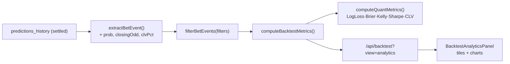

# Professional Quantitative Backtest Engine

**Date:** 2026-07-18
**Scope:** Upgrade the backtest from basic ROI/PnL to a professional quant engine with proper scoring, bankroll growth, risk-adjusted return, and closing-line value — with charts.

> Built on the existing settled-history pipeline (`predictions_history` → `extractBetEvent` → metrics). All metrics are computed from real stored bets; nothing is fabricated. Backward compatible: the dashboard, snapshot cron, and Model Lab keep working.

---

## Metrics

Computed in `server-utils/backtest/BacktestAnalytics.js` (`computeBacktestMetrics` + `computeQuantMetrics`):

| Metric | Field | Definition |
|--------|-------|------------|
| **Accuracy** (Hit Rate) | `hitRate` | wins / settled × 100 |
| **ROI** | `roi` | Σpnl / Σstake × 100 |
| **Yield** | `yield` | ROI on turnover (≡ ROI for flat/variable staking on turnover) |
| **Profit** | `profit` / `pnlUnits` | gross winning units / net units |
| **Expected Value** | `expectedValue` | mean stored EV% of staked bets |
| **Kelly Growth** | `kellyGrowthPct` | `(final bankroll − 1) × 100`, compounding each bet's staked fraction: `×(1+f(odd−1))` win / `×(1−f)` loss |
| **LogLoss** | `logLoss` | mean `−ln(p)` where p = model prob of the realized selection outcome |
| **Brier Score** | `brier` | mean `(p − outcome)²` on the staked selection |
| **CLV** (when available) | `clv`, `clvAvailable` | mean `(bet odd / closing odd − 1) × 100`; beat-rate in `clvBeatRate` |
| **Maximum Drawdown** | `maxDrawdown` | largest peak-to-trough drop of the equity curve (units) |
| **Sharpe Ratio** | `sharpe`, `sharpeAnnualized` | `mean(return)/std(return)`; annualized by observed bets/year |

Supporting fields: `kellyFinalBankroll`, `kellyMaxDrawdownPct`, `growthGeoMeanPct`, `avgReturn`, `returnStd`, `clvCount`, plus streaks, average odds/confidence.

### Notes on scoring
- **LogLoss / Brier** are proper scores on the **binary staked selection** (won/lost vs the model's probability for that pick), the standard evaluation for a betting backtest. The probability is read from `raw_payload.evaluation.modelProbs1x2Pct` (fallback: calibrated triple, then `valueBet.prob`, then confidence).
- **Kelly Growth** compounds a bankroll using each bet's staked fraction (the model's quarter-Kelly stake), giving realized geometric growth — not a theoretical optimum.
- **Sharpe** uses per-unit returns `pnl/stake`; annualization scales by `√(bets per year)` from the observed date span.
- **CLV** requires closing odds. These are **not yet captured** at predict time (documented gap), so `clvAvailable` is usually `false`. The engine reads closing odds from `raw_payload.closingOdds` / `oddsClosing` / `marketOdds.closing` or `closing_odds_*` columns the moment they exist — no further code change needed to activate CLV.

---

## Charts

Rendered in `src/components/backtest/BacktestAnalyticsPanel.tsx` (components in `BacktestCharts.tsx`):

| Chart | Series | Component |
|-------|--------|-----------|
| Equity curve | `series.equity` (cumulative units) | `EquityChart` |
| **Kelly bankroll growth** | `series.kelly` (compounded ×) | `KellyGrowthChart` |
| **Drawdown (underwater)** | `series.equity[].drawdown` | `DrawdownChart` |
| **Returns distribution** | `series.returnsHistogram` | `ReturnsHistogramChart` |
| Daily PnL | `series.daily` | `DailyPnlChart` |
| ROI by market / league | `series.byMarket` / `byLeague` | `BreakdownBarChart` |

Metric tiles include a dedicated **Quantitative metrics** row: Kelly Growth, Sharpe (+annualized), LogLoss, Brier, CLV, Kelly drawdown.

---

## API

The professional metrics ride on the existing analytics route (no new serverless function):

```
GET /api/backtest?view=analytics&period=30d
```

`metrics` now includes `logLoss`, `brier`, `kellyGrowthPct`, `kellyFinalBankroll`, `kellyMaxDrawdownPct`, `sharpe`, `sharpeAnnualized`, `avgReturn`, `returnStd`, `clv`, `clvAvailable`, `clvCount`, `clvBeatRate`. `series` adds `kelly` and `returnsHistogram`. Filters (period, league, competition, market, side, confidence, odds, positive-EV) and CSV/JSON export are unchanged.

---

## Data flow



---

## Configuration

- Staking fraction per bet comes from the stored quarter-Kelly stake (`valueBet.kelly`), capped at 3%.
- Kelly compounding caps the per-bet fraction at 50% for numerical safety.
- All filters via query params; window via `period`/`days`.

---

## Verification

- `node --test tests/math.test.js` → **60 pass** (new test asserts LogLoss, Brier, Kelly growth, Sharpe, CLV averaging, drawdown, and that `computeBacktestMetrics` surfaces every quant field).
- `npm run build` → frontend compiles with the new charts.
- `node --check` on `api/backtest.js` + `BacktestAnalytics.js` → OK.

## Files changed

| File | Change |
|------|--------|
| `server-utils/backtest/BacktestAnalytics.js` | `extractBetEvent` captures prob/closing/CLV; **new** `computeQuantMetrics`; metrics extended with LogLoss, Brier, Kelly growth, Sharpe, CLV, curves |
| `api/backtest.js` | Analytics `series` exposes `kelly` + `returnsHistogram` |
| `src/types.ts` | `BacktestMetrics` + series types extended |
| `src/components/backtest/BacktestCharts.tsx` | **New** Kelly growth, drawdown, returns-histogram charts |
| `src/components/backtest/BacktestAnalyticsPanel.tsx` | Quant metric tiles + new charts |
| `tests/math.test.js` | Quant metrics unit test |

*Backtesting is evaluative only — it never alters live predictions.*
