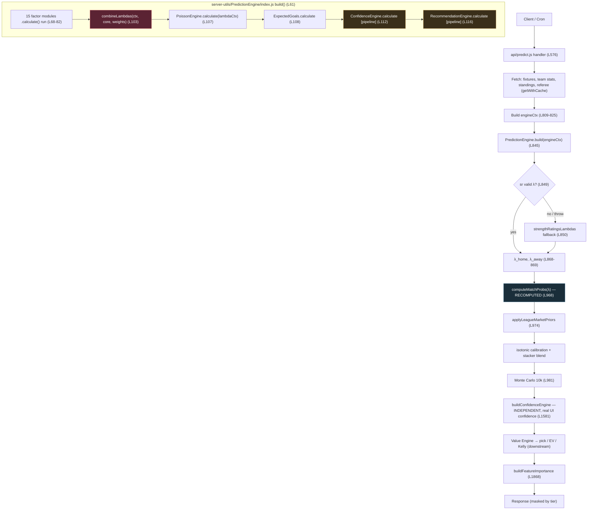

# Prediction Engine Execution Report

**Role:** Lead AI Architect — activation analysis (no feature work, no code changes)
**Date:** 2026-07-18
**Objective:** Trace the live prediction pipeline and determine exactly which modules execute, which are skipped, which receive empty data, and which are disabled by configuration.
**Method:** Static execution trace of `api/predict.js` → `server-utils/PredictionEngine/*` → combiner → confidence/recommendation. Evidence cited by file:line.

> **Headline finding:** The pipeline is **wired but throttled**. Every factor module's `calculate()` **does run**, but the combiner nullifies all *optional* modules because **`modularBlend = 0`** (`server-utils/PredictionEngine/weights.js:30`, applied in `combine.js:70-71`). As a result, live λ is produced by only **4 modules** (attack, defense, form, home advantage) and is **numerically identical to the legacy `strengthRatingsLambdas` fallback** — by design (`weights.js:3`). Eleven modules execute with no effect on λ; several also receive empty inputs; and an entire duplicate module tree in `server-utils/prediction/` is dead code.

---

## 1. Execution Flow Diagram

Legend: red = throttling point (`modularBlend=0`); amber = executes but output used for audit only; blue = probabilities recomputed outside the engine.

---

## 2. Active Modules (materially affect the live prediction)

These four factor modules feed **base λ** in `combine.js:42-54` with exponent weight `1.0` and always receive real data from `engineCtx`.

| Module | File | Weight | Role in live λ | Evidence |
|--------|------|:------:|----------------|----------|
| AttackStrength | `PredictionEngine/AttackStrength.js` | 1.0 | `(atkH/leagueAvg)^attack`, `(atkA/leagueAvg)^attack` | `combine.js:44,51` |
| DefenseStrength | `PredictionEngine/DefenseStrength.js` | 1.0 | `(defA/leagueAvg)^defense`, `(defH/leagueAvg)^defense` | `combine.js:45,52` |
| FormEngine | `PredictionEngine/FormEngine.js` | 1.0 | `hf^form`, `af^form` (clamped 0.9–1.1) | `combine.js:37-38,47,54` |
| HomeAdvantage | `PredictionEngine/HomeAdvantage.js` | 1.0 | `homeAdv^ha`, `awayAdv^ha` | `combine.js:39-40,46,53` |

**Also active (downstream of λ, outside `build`'s influence on λ):**

| Stage | File / Call | Status |
|-------|-------------|--------|
| Poisson score PMF + 1X2/O-U | `math.js` `computeMatchProbs` (`predict.js:968`) | **Active** — this, not the engine's `PoissonEngine`, produces the probabilities used downstream |
| League market priors | `applyLeagueMarketPriors` (`predict.js:974`) | Active |
| Isotonic calibration + stacker | `isotonicCalibration.js`, `mlStacker.js` | Active (data-dependent) |
| Monte Carlo 10k | `MonteCarloEngine.js` (`predict.js:981`) | Active |
| **Independent Confidence Engine** | `buildConfidenceEngine` (`predict.js:1581`) | Active — this is the real user-facing confidence (12 dimensions) |
| Value Engine | `value/ValueEngine.js` | Active — actual pick / EV / Kelly |
| Feature Importance | `buildFeatureImportance` (`predict.js:1868`) | Active (display/audit) |

---

## 3. Inactive Modules (execute but do NOT affect λ)

All are invoked in `build()` (`index.js:73-82`) and passed to `combineLambdas`, but their contribution flows only through `optionalAdjustment(...) = 1 + modularBlend × Σ …` (`combine.js:14-20,70-71`). With **`modularBlend = 0`**, the adjustment is exactly `1.0`, so **none of these change λ**, regardless of their individual weight.

| Module | File | Configured weight | Receives data? | Effect on λ |
|--------|------|:-----------------:|:--------------:|:-----------:|
| StandingsEngine | `PredictionEngine/StandingsEngine.js` | 0.15 | **Yes** (`homeStandingsRow/awayStandingsRow`) | **0** (blend=0) |
| RecentMatches | `PredictionEngine/RecentMatches.js` | 0.12 | Partial (from stats) | **0** (blend=0) |
| H2HEngine | `PredictionEngine/H2HEngine.js` | 0.10 | **No** (`h2hFixtures` not in ctx) | **0** (blend=0 + empty) |
| RestDaysEngine | `PredictionEngine/RestDaysEngine.js` | 0.08 | **No** (no last-match dates) | **0** (blend=0 + empty) |
| RefereeEngine | `PredictionEngine/RefereeEngine.js` | 0.05 | Name only (fallback) | **0** (blend=0) |
| AwayStrength | `PredictionEngine/AwayStrength.js` | 0.0 | Partial | **0** (weight & blend) |
| InjuriesEngine | `PredictionEngine/InjuriesEngine.js` | 0.0 | **No** (`injuries` not in ctx) | **0** (weight, blend, empty) |
| LineupEngine | `PredictionEngine/LineupEngine.js` | 0.0 | **No** (`lineups` not in ctx) | **0** (weight, blend, empty) |
| OddsEngine | `PredictionEngine/OddsEngine.js` | 0.0 | **No** (`odds` not in ctx) | **0** (weight, blend, empty) |
| MotivationEngine | `PredictionEngine/MotivationEngine.js` | 0.0 | **No** (no motivation input) | **0** (weight, blend, empty) |
| WeatherEngine | `PredictionEngine/WeatherEngine.js` | 0.0 | **No** (`weather` not in ctx) | **0** (weight, blend, empty) |

**Executed but output used for audit/display only (never feeds back into λ or the final pick):**

| Module | File | Where consumed | Note |
|--------|------|----------------|------|
| PoissonEngine | `PredictionEngine/PoissonEngine.js` | `index.js:107`, returned as `sr.probs`/`bestScore` | Redundant: `predict.js:968` recomputes probs via `computeMatchProbs`; engine probs are not the ones used downstream |
| ExpectedGoals | `PredictionEngine/ExpectedGoals.js` | `index.js:108` | Identity map (λ-as-xG); weight 0; feeds `luckStats` display only |
| ConfidenceEngine (pipeline) | `PredictionEngine/ConfidenceEngine.js` | `index.js:112` → `moduleScores.confidence` | **Not** the user confidence; the real one is `buildConfidenceEngine` (`predict.js:1581`) |
| RecommendationEngine | `PredictionEngine/RecommendationEngine.js` | `index.js:116` → `moduleScores.recommendation` | Audit-only argmax of Poisson probs; actual pick comes from the Value Engine downstream |

---

## 4. Dead Code (never imported at runtime)

`api/predict.js:18` and `api/history.js` import the engine **only** through the façade `server-utils/prediction/PredictionEngine.js`, which re-exports `server-utils/PredictionEngine/index.js` (`prediction/PredictionEngine.js:7-16`). A grep for imports of the duplicate module files returned **no matches** — the following are dead:

| Dead file | Reason |
|-----------|--------|
| `server-utils/prediction/AttackStrength.js` | Duplicate; not imported (live copy is `PredictionEngine/AttackStrength.js`) |
| `server-utils/prediction/DefenseStrength.js` | Duplicate; not imported |
| `server-utils/prediction/FormEngine.js` | Duplicate; not imported |
| `server-utils/prediction/HomeAdvantage.js` | Duplicate; not imported |
| `server-utils/prediction/Poisson.js` | Duplicate; not imported |
| `server-utils/prediction/StandingsEngine.js` | Duplicate; not imported |
| `server-utils/prediction/H2HEngine.js` | Duplicate; not imported |
| `server-utils/prediction/RefereeEngine.js` | Duplicate; not imported |
| `server-utils/prediction/RestDays.js` | Duplicate; not imported |
| `server-utils/prediction/RecentMatches.js` | Duplicate; not imported |
| `server-utils/prediction/predictionWeights.js` | Duplicate weights; not imported (live is `PredictionEngine/weights.js`) |
| `server-utils/prediction/_helpers.js` | Duplicate helpers; not imported |
| All matching `server-utils/prediction/*.ts` | TS sources shadowed by `.js` at runtime; not imported |

**Only** `server-utils/prediction/PredictionEngine.js` (the façade) and `server-utils/prediction/types.ts` are referenced. Everything else under `server-utils/prediction/` is removable without behavior change.

Additional partially-redundant execution (not dead, but wasted work): `PoissonEngine.calculate` inside `build()` recomputes a score PMF that `predict.js:968` computes again independently.

---

## 5. Missing Inputs (`engineCtx` gaps)

`engineCtx` is assembled at `predict.js:809-825`. It provides: `hStats`, `aStats`, `formHome/Away`, form multipliers, `leagueParams`, standings rows, `refereeName`, `fixtureId`, `fixtureDate`, team ids, `shrinkageK`. It **omits** the inputs every optional module needs:

| Missing ctx field | Modules starved | Observed behavior |
|-------------------|-----------------|-------------------|
| `injuries[]` | InjuriesEngine | `neutral({ reason: "injuries_not_provided", extensionPoint: true })` (`InjuriesEngine.js:9-10`) |
| `odds{home,draw,away}` | OddsEngine | `neutral({ reason: "odds_not_provided" })` (`OddsEngine.js:13-14`) |
| `lineups` | LineupEngine | neutral (XI not confirmed) |
| `weather` | WeatherEngine | neutral |
| `h2hFixtures` | H2HEngine | neutral (no historical meetings) |
| last-match dates | RestDaysEngine | neutral (cannot compute rest gap) |
| explicit motivation | MotivationEngine | neutral (rank-gap only when derivable) |

So even if `modularBlend` were raised, **H2H, RestDays, Injuries, Lineup, Odds, Weather, Motivation would still contribute ~0** until `engineCtx` is populated. Only **Standings** (and partially RecentMatches/Referee) would come alive immediately, because they already receive data.

Note: `OddsEngine` starvation is notable because odds **are** fetched elsewhere in `predict.js` (for the Value Engine / consensus) but are **not** passed into `engineCtx`.

---

## 6. Weight Table

Source: `server-utils/PredictionEngine/weights.js:12-31` (env-overridable via `PREDICT_WEIGHT_*`, then auto-calibration overlay).

| Key | Default | Enters λ via | Net effect on λ today |
|-----|:------:|--------------|------------------------|
| `attack` | 1.0 | base exponent (`combine.js:44,51`) | **Active** |
| `defense` | 1.0 | base exponent (`combine.js:45,52`) | **Active** |
| `form` | 1.0 | base exponent (`combine.js:47,54`) | **Active** |
| `homeAdvantage` | 1.0 | base exponent (`combine.js:46,53`) | **Active** |
| `standings` | 0.15 | optional × `modularBlend` | **0** (blend=0) |
| `recentMatches` | 0.12 | optional × `modularBlend` | **0** (blend=0) |
| `h2h` | 0.10 | optional × `modularBlend` | **0** (blend=0) |
| `restDays` | 0.08 | optional × `modularBlend` | **0** (blend=0) |
| `referee` | 0.05 | optional × `modularBlend` | **0** (blend=0) |
| `awayStrength` | 0.0 | optional × `modularBlend` | **0** |
| `injuries` | 0.0 | optional × `modularBlend` | **0** |
| `lineup` | 0.0 | optional × `modularBlend` | **0** |
| `odds` | 0.0 | optional × `modularBlend` | **0** |
| `motivation` | 0.0 | optional × `modularBlend` | **0** |
| `weather` | 0.0 | optional × `modularBlend` | **0** |
| `expectedGoals` | 0.0 | not used in λ | display only |
| `poissonCorrelation` | 0.12 | passed to PMF correlation | Active (via `computeMatchProbs`) |
| **`modularBlend`** | **0** | **global gate on all optional modules** | **Master off-switch** |

**Key insight:** `modularBlend` is a single master multiplier. `optionalAdjustment = 1 + modularBlend × Σ weightᵢ(factorᵢ−1)` (`combine.js:19`). At `0`, the entire optional block collapses to `1.0`, so the five non-zero optional weights (standings, recentMatches, h2h, restDays, referee) are **silently inert**.

---

## 7. Why Each Module Is Ignored

| Module | Root cause(s) | Category |
|--------|---------------|----------|
| Standings | `modularBlend=0` (has data + non-zero weight otherwise) | **Config-disabled** |
| RecentMatches | `modularBlend=0` | **Config-disabled** |
| H2H | `modularBlend=0` **and** `h2hFixtures` missing in ctx | Config + missing input |
| RestDays | `modularBlend=0` **and** no rest-day inputs | Config + missing input |
| Referee | `modularBlend=0` (name-only, uses fallback) | **Config-disabled** |
| AwayStrength | weight `0.0` **and** `modularBlend=0` | Config-disabled (double) |
| Injuries | weight `0.0`, `modularBlend=0`, `injuries` missing | Config + missing input |
| Lineup | weight `0.0`, `modularBlend=0`, `lineups` missing | Config + missing input |
| Odds | weight `0.0`, `modularBlend=0`, `odds` missing in ctx | Config + missing input |
| Motivation | weight `0.0`, `modularBlend=0`, no motivation input | Config + missing input |
| Weather | weight `0.0`, `modularBlend=0`, `weather` missing | Config + missing input |
| PoissonEngine (in build) | Output discarded; `predict.js:968` recomputes | Redundant execution |
| ExpectedGoals | Identity map; weight 0 | Display only |
| ConfidenceEngine (pipeline) | Superseded by independent `buildConfidenceEngine` | Audit only |
| RecommendationEngine | Superseded by Value Engine pick | Audit only |

**Design intent (documented, not accidental):** `weights.js:3` — *"Optional modules default to modularBlend=0 → numeric parity with strength-ratings."* The engine was shipped in **safe parity mode** so refactors could not change live outputs. Activation was deferred.

---

## 8. Estimated Impact If Activated

> Estimates are **directional** and qualitative. The repo has **no closing-line / CLV capture** (`featureCatalog.js` `MISSING_FEATURES`), so real lift must be validated by backtest (`BacktestAnalytics.js`) and, ideally, CLV once closing odds are stored. Treat these as hypotheses to test, not guarantees.

### Tier A — activatable now (data already in `engineCtx`)
Raising `modularBlend` (e.g. to ~0.5–1.0) with current inputs would immediately engage **Standings (0.15)**, **RecentMatches (0.12)**, and **Referee (0.05)**.

| Change | Expected effect | Confidence |
|--------|-----------------|:----------:|
| Standings live | Better separation of mismatched table positions; slightly sharper 1X2 on lopsided fixtures | Med |
| RecentMatches live | Momentum sensitivity beyond season-long averages | Med |
| Referee live | Minor O/U + cards nuance | Low |
| **Net** | Small but measurable calibration/ROI shift; **must A/B via backtest** since it moves every λ | Med |

**Risk:** because these currently produce **parity** with the fallback, turning them on will change **all** predictions at once. Recommend shadow-mode + backtest before flipping in production.

### Tier B — needs input wiring first (then weight + blend)
These require `engineCtx` to be populated before any weight matters.

| Module | Prerequisite input | Expected lift if wired well |
|--------|--------------------|------------------------------|
| Odds | Pass already-fetched 1X2 odds into ctx | **Highest** — market is a strong prior; Shin-mapped factor can improve calibration materially |
| Injuries | `/injuries` ingestion + cache | Med–High for games with key absences |
| Lineup | Confirmed XI feed | Med (pre-kickoff sharpening) |
| RestDays | Fixture congestion dates | Low–Med (fatigue edges) |
| H2H | Historical meetings | Low–Med (style/dominance signal) |
| Weather | Weather feed | Low (mostly totals) |
| Motivation | Standings stakes / context | Low |

### Tier C — structural upgrades (separate from blend)
- Replace `ExpectedGoals` identity with shot-based xG in λ (`ExpectedGoals.js` currently λ-as-xG).
- Blend Elo into λ (today Elo is a stacker feature only).
- Capture closing odds → compute CLV to actually **measure** all of the above.

### Overall
- **Structurally**, the engine already rivals Forebet-class modeling; the missing piece is **activation + input wiring + validation**, not new math.
- **Practically**, expect the largest, safest first win from **wiring odds into `engineCtx`** and **enabling Tier A via a controlled `modularBlend` increase**, each gated by backtest and (once available) CLV.
- **Do not** raise `modularBlend` blindly: with most optional modules starved of data, a high blend would amplify only Standings/RecentMatches/Referee while the rest stay neutral — a partial, potentially miscalibrated activation.

---

## Appendix — Evidence Index

| Claim | File:Line |
|-------|-----------|
| `modularBlend` default 0 | `server-utils/PredictionEngine/weights.js:30` |
| Parity-mode intent | `server-utils/PredictionEngine/weights.js:3` |
| Optional adjustment gated by blend | `server-utils/PredictionEngine/combine.js:14-20,70-71` |
| Base λ uses only attack/defense/form/HA | `server-utils/PredictionEngine/combine.js:42-54` |
| All 15 modules invoked | `server-utils/PredictionEngine/index.js:68-82` |
| Pipeline confidence/recommendation audit-only | `server-utils/PredictionEngine/index.js:112-142` |
| `engineCtx` construction (missing inputs) | `api/predict.js:809-825` |
| build() call + fallback to strength-ratings | `api/predict.js:845-866` |
| Probs recomputed outside engine | `api/predict.js:968-974` |
| Real user confidence engine | `api/predict.js:1581` |
| Injuries neutral on missing data | `server-utils/PredictionEngine/InjuriesEngine.js:9-10` |
| Odds neutral on missing data | `server-utils/PredictionEngine/OddsEngine.js:13-14` |
| Façade re-export (live path) | `server-utils/prediction/PredictionEngine.js:7-16` |
| Duplicate `prediction/*` modules unreferenced | grep: no imports found |

*Analysis only. No source files were modified.*
