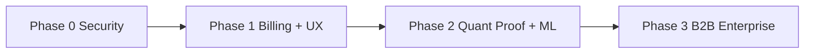

# Enterprise Production Audit — Footy Predictor

**Role:** CTO final production audit  
**Date:** 2026-07-18  
**Scope:** Full application (frontend, serverless API, prediction engine, cache, DB, ops, commercial)  
**Stack:** React 18 + Vite 5 + TypeScript · Vercel serverless (`api/`) · Supabase Auth/Postgres · Vercel KV / Upstash · API-Football  

**Executive verdict:** The **prediction / analytics core is unusually deep for a niche SaaS** (Dixon–Coles, Shin, isotonic calibration, multinomial stacker, value + confidence engines, backtest lab, ML scaffolding). **Security, billing, observability, and monolith hygiene are not enterprise-grade.** Ship as a controlled beta only after Critical Issues are closed; do not market as production-enterprise until Phase 2 of the roadmap.

**Overall score: 6.2 / 10** — strong product brain, incomplete commercial armor.

---

## Scorecard

| Dimension | Score | Grade | One-line rationale |
|-----------|------:|-------|--------------------|
| **Architecture** | **6.5** | B− | Clean serverless + shared `server-utils`, but `api/predict.js` is a god-handler (~1.9k LOC) |
| **Frontend** | **7.0** | B | Distinct sports-dashboard UX, tiered workspace; large main bundle, little E2E |
| **Backend** | **6.0** | C+ | Solid cron/ops surface; auth gaps, inconsistent validation, fat routes |
| **Prediction Engine** | **8.0** | A− | Modular math + calibration + stacker + value; ML trainers still scaffolding |
| **Cache** | **7.5** | B+ | KV TTLs, dedupe, warm/odds prefetch; env naming drift; fail-open RL |
| **Performance** | **6.5** | B− | Warm path + API optimization; cold starts + mega-predict still dominate |
| **Scalability** | **5.5** | C | Fine for hundreds of DAU; not multi-tenant / multi-region ready |
| **Security** | **4.0** | D | Release blockers: open alerts, missing RLS, client admin emails, tier escalation risk |
| **Maintainability** | **5.5** | C | Good docs/tests for math; poor API modularity and observability |
| **Prediction Quality** | **7.5** | B+ | Better than tip-sheet sites; not yet proven vs closing-line / Forebet long-run |
| **Commercial Readiness** | **3.5** | D+ | Freemium masking exists; **no Stripe/billing**; Premium limit &lt; Free |

**Weighted readiness for “enterprise SaaS”:** **~55%**.  
**Weighted readiness for “paid niche beta”:** **~70%** after Critical Issues.

---

## Competitor Comparison

Scores are relative (1–10) for product category fit, not absolute market valuation. Footy’s edge is **transparent model + EV tooling**; competitors win on **data breadth, brand, distribution, and polish**.

| Capability | This product | Forebet | FootyStats | BetClan | WinDrawWin | BetExplorer | SofaScore Predictions |
|------------|:------------:|:-------:|:----------:|:-------:|:----------:|:-----------:|:---------------------:|
| Statistical model depth | **8** | 7 | 6 | 5 | 6 | 5 | 6 |
| Market / value focus | **8** | 4 | 5 | 6 | 5 | **8** | 3 |
| Odds coverage & bookmakers | 5 | 4 | 6 | 5 | 6 | **9** | 4 |
| UX / mobile product | 6 | 5 | 6 | 6 | 5 | 6 | **9** |
| Live / in-play | 4 | 3 | 5 | 4 | 4 | 5 | **9** |
| Historical stats depth | 5 | 6 | **9** | 5 | 6 | **8** | 7 |
| Backtesting / ROI transparency | **8** | 5 | 4 | 4 | 4 | 5 | 2 |
| Calibration / probability science | **8** | 6 | 4 | 3 | 5 | 3 | 4 |
| Personalization / accounts | 6 | 4 | 6 | 5 | 4 | 4 | **8** |
| Monetization maturity | **3** | 7 | **8** | 6 | 6 | 7 | 7 |
| Brand / SEO / distribution | 2 | **8** | 7 | 5 | 6 | **8** | **9** |
| API / B2B readiness | 2 | 3 | **7** | 3 | 3 | 4 | 5 |
| Trust / compliance posture | 4 | 6 | 6 | 5 | 5 | 6 | 7 |

### Positioning summary

| Competitor | They win on | We win on | How to compete |
|------------|-------------|-----------|----------------|
| **Forebet** | SEO, volume of tips, brand habit | Explicit DC/Poisson + calibration + value EV | Publish public track record; don’t copy tip spam |
| **FootyStats** | Deep historical tables, API | Actionable pick + Kelly/EV layer | License/partner stats; keep decision UX |
| **BetClan** | Community / tip culture | Model auditability, observatory | Avoid tipster theater; sell edge science |
| **WinDrawWin** | Simple tips + stats blend | Backtest lab, stacker, confidence engine | Clearer free vs paid value ladder |
| **BetExplorer** | Odds comparison authority | Model-driven value (not just odds UI) | Closing-line store; CLV as north-star metric |
| **SofaScore Predictions** | Massive app distribution + live UX | Serious probability stack under the hood | Mobile polish + lighter “match center” mode |

**Strategic niche:** *“Quant lab for football betting decisions”* — not another tip sheet, not SofaScore.

---

## Strengths

1. **Real probabilistic pipeline** — Dixon–Coles / bivariate Poisson, Shin de-vig, isotonic calibration, multinomial LR stacker (`server-utils/math.js`, `isotonicCalibration.js`, `mlStacker.js`).
2. **Commercial-adjacent analytics** — Value engine (no negative EV recommendations), confidence engine, tier masking (`VALUE_ENGINE.md`, `CONFIDENCE_ENGINE.md`, `accessTier.js`).
3. **Ops-aware data path** — Warm + odds prefetch, history sync crons, API usage tracking, `API_OPTIMIZATION.md`.
4. **Backtest & observatory** — Settled KPIs, ROI/yield analytics, admin observatory, model performance snapshots.
5. **ML readiness without fake ML** — Feature store schema, extractors, model registry stubs (`ML_READY.md`, migration `022`).
6. **Auth + freemium skeleton** — Supabase Auth, profiles, trials, GDPR-oriented export paths.
7. **Math test investment** — Broad `tests/math.test.js` coverage for core probability / value / stacker logic.
8. **Documented architecture** — Prediction, value, confidence, API optimization, ML docs exist and match code intent.
9. **Differentiated UI direction** — Dark sports-lab aesthetic (Sora / Plus Jakarta), not generic purple SaaS.
10. **Cron surface for production rhythm** — Warm-predict, history sync, daily-ml, backtest snapshots (`vercel.json`).

---

## Weaknesses

1. **`api/predict.js` monolith** — Business, IO, tiering, persist, and response shaping in one file; high change risk.
2. **No payment rails** — Tiers are admin/trial assigned; cannot scale revenue.
3. **Security debt** — Open `/api/alerts`, missing RLS on core tables, admin emails in client bundle.
4. **Observability gap** — No Sentry/OTel; ops depend on DIY DB logs + console.
5. **Product limit inversion** — Default Premium daily matches (7) &lt; Free (10) — confuses pricing psychology.
6. **Upstream dependency** — Single primary data vendor (API-Football); limited multi-source resilience.
7. **Frontend state sprawl** — Hooks + localStorage, no shared client store; harder multi-page scale.
8. **Bundle size** — ~680KB+ main JS + large Recharts chunk; weak code-splitting strategy.
9. **Test pyramid incomplete** — Strong unit/math; weak API auth, RLS, E2E, load tests.
10. **Distribution** — No SEO content engine, no public verified tip archive, no mobile app.
11. **i18n / market** — Romanian-first copy; limits EU expansion without localization.
12. **KV package drift** — `@vercel/kv` deprecated path; multiple env alias families.

---

## Critical Issues

> Treat as **release blockers** before paid / public scale.

| ID | Severity | Issue | Evidence | Required fix |
|----|----------|-------|----------|--------------|
| **C1** | **P0** | `/api/alerts` has **no authentication** and reads KPI + history via **service role** | `api/alerts.js` | Require admin JWT or `CRON_SECRET`; rate-limit |
| **C2** | **P0** | `predictions_history` has **no RLS** | `001_predictions_history.sql` (+ later alters) | `ENABLE ROW LEVEL SECURITY` + deny-all for anon/authenticated; service_role only |
| **C3** | **P0** | `backtest_snapshots` has **no RLS** | `002_backtest_snapshots.sql` | Same as C2 |
| **C4** | **P0** | `notification_dispatch_log` has **no RLS** | `007_notifications_log.sql` | Same as C2 |
| **C5** | **P0** | `profiles` UPDATE policy has **no column allowlist** — users may self-escalate `tier` / trial fields if grants allow | `008_profiles_rls_no_recursion.sql` | Trigger or column-restricted policy; server-only tier mutations |
| **C6** | **P0** | **Admin emails shipped in client bundle** via `VITE_ADMIN_EMAILS` | `src/hooks/useAuth.ts`; visible in `dist/assets/index-*.js` | Server-only `ADMIN_EMAILS`; client checks role from DB only |
| **C7** | **P1** | Any valid JWT can trigger **history sync** (upstream quota burn) | `api/history.js` `isAuthorizedHistorySync` | Cron + admin only (or strict per-user cooldown + scope) |
| **C8** | **P1** | Anon rate limit **fails open** when KV missing | `anonymousRateLimit.js` pattern | Fail closed or degrade to in-memory + hard caps |
| **C9** | **P1** | Cron secret accepted via **query string** | `cronRequestAuth.js` / README | Header-only; rotate if ever logged |
| **C10** | **P1** | No hard **API-Football budget circuit breaker** near plan limit | Usage tracked but predict continues | Soft/hard stop + admin alert at 80/95% |

---

## Technical Debt

| Area | Debt | Impact |
|------|------|--------|
| `api/predict.js` size | Orchestration + feature assembly + persist | Slow reviews, regression risk |
| Dual math paths | `math.js` + `prediction/*` modules | Cognitive load; drift risk |
| JS/TS mix | Runtime JS API + TS frontend | Type holes at the boundary |
| KV clients | `@vercel/kv` + `@upstash/redis` + `redis` | Confusion, duplicate adapters |
| Env alias sprawl | `KV_*`, `UPSTASH_*`, `STORAGEE_KV_*`, `Database_KV_*` | Onboarding / incident friction |
| History as feature store | Heavy `raw_payload` JSONB | Query cost; schema evolution pain |
| Client-triggered sync | Logged-in users can sync | Quota + race conditions |
| Premium &lt; Free limits | Default env constants | Product/trust debt |
| ML scaffolding unused | Tables/adapters without trainers | Dead weight until Phase 3 |
| Chart laziness partial | Analytics split; main still heavy | LCP / TTI on workspace |
| No OpenAPI contract | Ad-hoc query/body parsing | Client/server drift |
| Romanian hardcoding | UI strings | Expansion cost |

---

## Production Risks

| Risk | Likelihood | Impact | Mitigation |
|------|------------|--------|------------|
| Data leak via PostgREST on history/backtest | Med | Critical | C2–C4 immediately; audit grants |
| Tier fraud via profile self-update | Med–High | High | C5 + server-side tier authority |
| API-Football quota exhaustion / bill spike | High | High | C7, C8, C10; warm budgets |
| Cold-start timeouts on warm-predict / daily-ml | Med | Med | Split jobs; queue; raise monitoring |
| Model drift without alerting that is secure | Med | Med | Fix C1 then wire pager |
| Secret leakage via `?secret=` in logs/CDN | Low–Med | High | C9 |
| Single-region Vercel + single DB | Med | Med | RTO/RPO plan; backups verified |
| Legal / gambling compliance (jurisdiction) | Med | High | Geo disclaimers, age gate, terms |
| Competitor CLV / tip pages outrank SEO | High | Med | Public verified performance pages |
| Key person / repo bus factor | Med | High | Modularize predict; runbooks |

---

## Top 100 Improvements

### Security & compliance (1–20)

1. Authenticate `/api/alerts` (admin or cron).
2. Enable RLS deny-all on `predictions_history`.
3. Enable RLS deny-all on `backtest_snapshots`.
4. Enable RLS deny-all on `notification_dispatch_log`.
5. Add DB trigger: block client updates to `tier`, `role`, `subscription_expires_at`, trial columns.
6. Remove `VITE_ADMIN_EMAILS` from client; keep `ADMIN_EMAILS` server-only.
7. Restrict history sync to cron + admin.
8. Fail-closed anonymous rate limiting without KV.
9. Disallow cron auth via query string.
10. Add request ID + structured security audit log.
11. Zod (or similar) validation on all API inputs.
12. CSP + security headers on Vercel.
13. Rotate all secrets after any query-param cron usage.
14. Penetration test auth boundaries (anon / user / admin / cron).
15. Supabase grant audit script in CI.
16. Age gate + responsible gambling copy.
17. Geo/jurisdiction disclaimer for betting features.
18. Privacy policy ↔ actual data retention alignment.
19. GDPR delete path (not only export).
20. WAF / bot protection on `/api/predict` and `/api/warm`.

### Architecture & backend (21–40)

21. Split `api/predict.js` into pipeline stages (fetch → features → model → value → persist → mask).
22. Introduce OpenAPI for public/private routes.
23. Shared error taxonomy (`AppError` codes).
24. Idempotent predict persist keys.
25. Queue for warm/sync (Inngest / QStash / BullMQ).
26. Separate read models for observatory vs user history.
27. Normalize KV env to one Upstash contract.
28. Migrate off deprecated `@vercel/kv` packaging.
29. Circuit breaker for upstream API-Football.
30. Multi-provider odds fallback.
31. Per-league feature flags.
32. Config service for `MODEL_VERSION` + weights pointers.
33. Soft-delete / retention job for `raw_payload` bloat.
34. Paginated admin history (cursor).
35. Extract cron handlers from user-facing routes.
36. Add `/api/health` (deps: KV, Supabase, upstream).
37. Blue/green model weights activation.
38. Shadow-mode predictions for candidate models.
39. Contract tests for maskPredictionForTier.
40. Server-side request timeouts and abort propagation.

### Prediction quality (41–55)

41. Persist closing odds; compute CLV.
42. Odds movement timeline store.
43. H2H feature persistence.
44. Injuries / lineups ingestion (cached).
45. Rest-days features always populated.
46. Referee priors when available.
47. Form points features (not only strings).
48. Shot-based xG rolling where licensed.
49. League-specific stacker promotion gates.
50. Public calibration dashboards (ECE, reliability).
51. Holdout economic metric (ROI only on EV&gt;0).
52. Train LightGBM/XGBoost offline on `ml_training_examples`.
53. Isotonic refresh monitoring (sample size floors).
54. Dixon–Coles ρ re-fit cadence per league.
55. No-bet policy analytics (opportunity cost).

### Cache & performance (56–70)

56. Budgeted warm: fixtures → odds → teamstats priority order.
57. Edge cache for public league lists.
58. Predict response compression audit.
59. Client SWR/query cache with stale-while-revalidate.
60. Vite `manualChunks` for recharts/router/supabase.
61. Route-level code splitting for admin vs user.
62. Image/logo CDN for crests.
63. Live poll backoff jitter (already 75s — tune by status).
64. Prefetch only selected leagues for free tier.
65. KV key cardinality alarms.
66. In-flight dedupe metrics exported.
67. Avoid N+1 odds in predict (batch path enforcement).
68. SSR or prerender marketing landing only.
69. Bundle size CI budget (e.g. 400KB gzip main).
70. DB index review for admin observatory filters.

### Frontend & UX (71–85)

71. Fix Premium daily limit ≥ Free (product sense).
72. Clear paywall modals with feature matrix.
73. Public track-record page (verified settled picks).
74. Match center lite mode (SofaScore-competitive skim).
75. Mobile nav polish / thumb-zone CTAs.
76. Empty/error skeletons consistency.
77. Accessibility pass (contrast, focus, aria).
78. i18n framework (RO/EN minimum).
79. Onboarding that teaches EV/Kelly safely.
80. Notification preferences UX completeness.
81. Export CSV from user history.
82. Reduce Observatory cognitive load for non-admins.
83. Keyboard shortcuts for power users.
84. Offline-tolerant local cache of last predict.
85. Design system tokens documentation.

### Commercial & growth (86–95)

86. Stripe Checkout + Customer Portal.
87. Webhooks → tier sync (idempotent).
88. Usage-based ultra plan option.
89. Affiliate / tipster-safe embed widget.
90. SEO content: league hubs + methodology pages.
91. Email digests (Resend) with value picks only.
92. B2B API (rate-limited, keyed) for affiliates.
93. Annual plan + trial conversion funnel metrics.
94. Churn win-back on trial expiry.
95. Competitor CLV marketing (honest, audited).

### Ops, quality, enterprise (96–100)

96. Sentry (or equivalent) on API + frontend.
97. PagerDuty/Slack on cron failure + quota &gt;80%.
98. Load test warm-predict at peak kickoff windows.
99. RLS + auth regression suite in CI.
100. SOC2-oriented runbooks: incident, key rotation, backup restore drill.

---

## Roadmap to Enterprise Grade

### Phase 0 — Stabilize (1–2 weeks) — **must ship before paid scale**

- Close **C1–C10**.
- Fix Premium vs Free limits.
- Add `/api/health` + Sentry.
- CI: RLS grant smoke + alerts auth test.
- **Exit criteria:** No unauthenticated service-role read endpoints; core tables RLS-enabled; admin emails not in bundle.

### Phase 1 — Sellable beta (3–6 weeks)

- Stripe subscriptions + webhooks → `profiles.tier`.
- Paywall UX + public methodology + verified track record.
- Split predict pipeline into modules; OpenAPI for 5 core routes.
- Closing-odds capture for CLV.
- Hard upstream budget guard.
- **Exit criteria:** Paying customers can self-serve; quota cannot silently bankrupt the API plan.

### Phase 2 — Credible quant product (6–12 weeks)

- Feature store population job → `ml_training_examples`.
- Offline LightGBM/XGBoost candidates; shadow predictions.
- Calibration + economic dashboards public (subset).
- Queue-based warm/sync; multi-provider odds.
- i18n EN; SEO league pages.
- **Exit criteria:** Candidate model beats stacker on time-split log-loss + EV&gt;0 ROI; public proof page.

### Phase 3 — Enterprise / B2B (3–6 months)

- Tenant isolation (teams/orgs), API keys, SLA dashboards.
- Formal DR (PITR drills, multi-region read replica strategy).
- Compliance pack (terms, geo, responsible gambling, DPA).
- Design system + mobile PWA or native shell.
- Optional FootyStats-like data partnerships.
- **Exit criteria:** SOC2-ready controls checklist ≥80%; B2B pilot with contract + keyed API.

---

## Dimension Notes (audit detail)

### Architecture — 6.5
Vercel + Supabase + KV is a valid scale-up path. Shared `server-utils` is the right idea. The predict god-file and dual prediction module trees prevent “enterprise” modular ownership.

### Frontend — 7.0
Workspace UX, value cards, analytics, and observatory are ahead of most tip sites. Missing: E2E, a11y program, i18n, and marketing-grade public surfaces that SofaScore/Forebet use for acquisition.

### Backend — 6.0
Crons, warm, history sync, admin ML views show operational maturity. Auth inconsistencies and missing schema validation prevent a clean security story.

### Prediction Engine — 8.0
Best-in-repo asset. Competitive with Forebet-class modeling intent; stronger than BetClan/WinDrawWin on calibration/stacking narrative. Needs CLV + longer public verification to claim superiority.

### Cache — 7.5
`req:v2` keys, dedupe, warm, odds batching are solid. Fail-open RL and env sprawl are the main enterprise gaps.

### Performance — 6.5
Acceptable for curated league sets. Peak Saturday multi-league predict without warm will hurt. Bundle weight hurts perceived quality vs SofaScore.

### Scalability — 5.5
OK to low thousands of MAU with discipline. Not ready for viral SofaScore-like traffic or multi-tenant B2B without queues and stricter budgets.

### Security — 4.0
Multiple P0s verified in code. Do not call the system “production secure” until Phase 0 completes.

### Maintainability — 5.5
Docs + math tests help. Monoliths and mixed JS/TS hurt onboarding velocity.

### Prediction Quality — 7.5
Architecture supports quality; quality is not fully proven commercially (CLV, long-horizon ROI publication). Treat as **promising**, not **market-proven**.

### Commercial Readiness — 3.5
Masking and trials are a start. Without Stripe, legal packaging, and a coherent paid ladder, this is a **lab**, not a **business**.

---

## Final CTO Recommendation

| Question | Answer |
|----------|--------|
| Can we keep building features? | **Yes** — prediction/analytics depth is the moat. |
| Can we take paid traffic tomorrow? | **No** — close Critical Issues first. |
| Can we out-compete SofaScore on UX? | **Not soon** — don’t try; win on EV transparency. |
| Can we out-compete Forebet on trust? | **Yes, if** we publish audited settled performance + CLV. |
| Can we out-compete BetExplorer on odds? | **No** — partner or embed; stay model-first. |
| What is the single most valuable next bet? | **Phase 0 security + Stripe + public track record.** |

**Sign-off stance:** Approve continued R&D; **conditional go-live** only after Phase 0. Enterprise grade is a **2–3 quarter program**, not a polish pass.

---

*Generated from repository inspection (migrations, `api/`, `server-utils/`, `src/`, `vercel.json`, docs). Competitor scores are category judgments for strategy, not scraped live metrics.*
