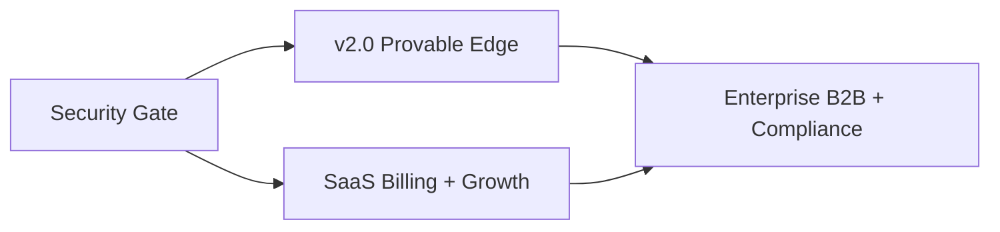

# Enterprise Audit Report — Footy Predictor Pro

**Role:** CTO-level full production audit
**Date:** 2026-07-18
**Repository:** `footy-predictor-starter`
**Branch:** `refactor/frontend-app-architecture`
**Production:** https://footy-predictor-pro.vercel.app
**Stack:** React 18 + Vite 5 + TypeScript · Vercel serverless (`api/`) · Supabase Auth/Postgres · Vercel KV / Upstash Redis · API-Football

> This report supersedes `ENTERPRISE_AUDIT.md` (same day) and reflects the newly shipped **Enterprise Dashboard** and **Enterprise Monitoring / Health Dashboard** work (commits `626e716`, `306fa15`, `9d48e87`). Every claim is grounded in current source inspection.

---

## Executive Verdict

Footy Predictor Pro has a **genuinely deep quantitative core** — Dixon–Coles / bivariate Poisson, Shin de-vig, isotonic PAV calibration, a trained multinomial-LR stacker, 10k Monte Carlo, a multi-market value engine with hard negative-EV guards, a 12-dimension confidence engine, backtest analytics, and now first-class observability. This is **well beyond a tip-sheet website** and is the product's moat.

However, it is **not yet enterprise-grade** where it matters commercially: **all P0 security issues from the prior audit remain open**, there is **no billing/Stripe**, the **paid ladder is inverted** (Premium 7 < Free 10 daily matches), and much of the modular prediction depth is **wired but inactive** (`modularBlend: 0`). The newly added monitoring meaningfully improves the observability story but its **tests are not in CI** and its data resets with serverless cold starts (process-local counters + KV day buckets).

**Overall score: 6.4 / 10** — exceptional product brain, still-immature commercial and security armor. Up from 6.2 primarily due to shipped observability.

**Readiness gates:**
- Paid niche beta: **~72%** (after closing P0 security).
- Enterprise SaaS: **~55%**.

---

## Scorecard

| Dimension | Score | Grade | One-line rationale |
|-----------|:----:|:-----:|--------------------|
| Architecture | 6.5 | B− | Clean serverless + shared `server-utils`; `api/predict.js` remains a ~2.2k-LOC god-handler |
| Prediction Engine | 8.0 | A− | Strong DC/Poisson + calibration + stacker; modular factors inactive, no CLV proof |
| Confidence Engine | 7.5 | B+ | Independent 12-dimension scorer, clean contract; some scorers use fallbacks |
| API | 6.0 | C+ | Consolidated view-dispatch routes; auth gaps, ad-hoc validation, fat handlers |
| Cache | 7.5 | B+ | `req:v2` keys, in-flight dedupe, warm/odds prefetch, now latency-instrumented |
| Performance | 6.5 | B− | Warm path + DB-only budgeting; 681 KB main bundle, cold starts, no `manualChunks` |
| Security | 4.0 | D | 9/10 prior P0s still open: unauth alerts, missing RLS, tier self-escalation, admin emails in bundle |
| Testing | 5.5 | C | 72 authored tests (deep math); no E2E/RLS/API-integration; observability tests orphaned |
| Observability | 7.0 | B | **New**: structured logs, latency/failure metrics, health bundle, ops alerts, daily report cron |
| Commercial Readiness | 3.5 | D+ | Masking + trials only; no Stripe; Premium < Free; RO-only; no public track record |

**Weighted overall: 6.4 / 10.**

---

## Dimension Inspection

### 1. Architecture — 6.5

- **Shape:** Vite/React SPA + Vercel serverless functions in `api/` + shared `server-utils/` + Supabase + KV. Sound scale-up topology.
- **Route consolidation:** Endpoints use `?view=` dispatchers to stay under the Hobby **12-function limit** — `api/fixtures.js` (day/live/xg), `api/backtest.js` (kpi/analytics/snapshot/metrics/health), `api/admin.js` (profiles/ml). Pragmatic, but overloads single files.
- **Frontend refactor:** `src/App.tsx` reduced to ~165 lines; orchestration in `useAppController.ts` (~342 lines) + specialized hooks + thin services (`REFACTOR_REPORT.md`). Good separation.
- **Debt:** `api/predict.js` (~2.2k LOC) mixes fetch → features → model → value → persist → tier-mask. Dual math trees: `server-utils/math.js` (canonical) + `server-utils/PredictionEngine/*` (modular) + `server-utils/prediction/*` (dead facade). JS backend / TS frontend split creates a typing boundary hole.

### 2. Prediction Engine — 8.0

- **Core (`math.js`):** univariate + **bivariate Poisson** (Karlis–Ntzoufras shared component), **Dixon–Coles** low-score τ (ρ default −0.11, per-league from draw frequency), adaptive score-grid PMF with tail renormalization, Bayesian shrinkage (k=6), exponential form decay.
- **De-vig / staking (`advancedMath.js`):** **Shin (1993)** implied probabilities via bisection, quarter-Kelly, ensemble stake, synthetic xG from shots.
- **Elo (`teamElo.js`):** margin-amplified K, Gaussian-on-spread draw model, persisted to `team_elo`; used as a **parallel signal** (stacker feature + explanation), not blended into λ.
- **Modular engines (`PredictionEngine/`):** 18 modules (Attack, Defense, Form, HomeAdvantage, AwayStrength, RecentMatches, Standings, H2H, Referee, Injuries, Lineup, Odds, RestDays, Motivation, Weather, Poisson, ExpectedGoals, Recommendation).
- **Critical gap:** default `modularBlend: 0` and injuries/lineup/odds/motivation/weather weights are **0**; `engineCtx` in `predict.js` omits h2h/injuries/weather/odds/lineups/restDays. **At runtime, λ ≈ `strengthRatingsLambdas`** — the rich modules are extension points, not live signal. `ExpectedGoals` is an identity map (λ-as-xG), so shot-based xG is not in λ.
- **Calibration (real, not scaffolding):** isotonic **PAV** fit + piecewise interpolation per outcome (`isotonicCalibration.js`); **multinomial LR stacker** with mini-batch SGD training and Brier/log-loss/accuracy metrics (`mlStacker.js`, `api/cron/daily-ml.js`); auto-calibration weight overlays with ECE/reliability that never overwrite env-locked manual weights (`AutoCalibrationEngine.js`).
- **Monte Carlo:** 10k sims (env-clamped 1k–50k), seeded `mulberry32`, distributions + Wilson/percentile CIs.
- **Missing for proven quality:** closing-odds capture, **CLV**, odds-movement store, stored injuries/rest/weather features, shot-xG rolling (acknowledged in `featureCatalog.js` `MISSING_FEATURES`).

### 3. Confidence Engine — 7.5

- Independent scorer (`confidence/ConfidenceEngine.js`) over **12 dimensions** (attack .14, defense .14, form .10, standings .10, oddsConsensus .09, recentMatches .08, h2h .07, injuries .06, restDays .06, homeAdvantage .06, referee .05, lineups .05).
- Each dimension yields a 0–100 score + `available` flag; overall = weighted sum over normalized available weights; categorized Very Low → Very High.
- Clean contract: **does not** read or mutate λ / Poisson / pick probability. Some scorers degrade to hash/sample proxies when data missing (referee, recentMatches) — a transparency caveat.

### 4. API — 6.0

- Consolidated, documented view-dispatch handlers; admin routes use `assertAdmin`; predict has anon rate limiting + tiered DB-only budgeting.
- **Weaknesses:** `/api/alerts` unauthenticated (service-role reads); history sync callable by any JWT; **no schema validation** (no zod) — numeric clamping + manual `JSON.parse` only; god-handler in predict; cron secret accepted via query string.

### 5. Cache — 7.5

- `req:v2:{endpoint}?{sortedqs}` provider-agnostic keys, legacy dual-write, **in-flight dedupe** (`inflight` Map), daily KV cache-stat buckets, process-local hit ratio, warm + odds prefetch crons.
- **Now instrumented:** `getWithCache` records cache-read/-write and upstream latency + failures into the metrics store.
- **Gaps:** env alias sprawl (`KV_*`, `UPSTASH_*`, `Database_KV_*`), deprecated `@vercel/kv` packaging, fail-open behavior on KV loss.

### 6. Performance — 6.5

- Warm-predict + odds prefetch + DB-only fallback (≥75% quota) reduce upstream pressure; predict compute bounded to ≤15 fixtures/request.
- **Bundle:** main `index-*.js` **~681 KB**, Recharts chunk ~377 KB, no `manualChunks` in `vite.config.js`. Admin panels lazy-loaded (Enterprise/Health/Backtest). Cold starts + Saturday multi-league predict remain the tail-latency risk.

### 7. Security — 4.0 (release blocker)

- **9 of 10 prior P0/P1 issues still open**, C10 partially mitigated (see matrix below).
- RLS **missing** on `predictions_history`, `backtest_snapshots`, `notification_dispatch_log`; `profiles` UPDATE policy lacks a **column allowlist**, allowing potential `tier`/`subscription_expires_at` self-escalation via PostgREST; **admin email literal shipped in `dist/`**; anon rate limit fails **open**; cron secret via query string.
- Positive controls: most ML/calibration/ops tables use `using(false)` deny-all; sensitive RPCs revoked from `public`; admin API routes gated.

### 8. Testing — 5.5

- **72 authored tests**: `tests/math.test.js` (57 — probability, value, stacker, backtest, Monte Carlo, calibration), `tests/observability.test.js` (4), Vitest frontend (11 — predict flow, date rollover, history sync).
- **Gaps:** `observability.test.js` is **not referenced by `npm test`** (orphaned from CI); **no E2E** (no Playwright/Cypress); **no RLS/auth/API-integration** tests. CI (`.github/workflows/tests.yml`) runs `npm test` only — no build/lint/E2E.

### 9. Observability — 7.0 (new)

- `server-utils/observability/`: structured JSON `logger.js`; `metricsStore.js` (per-route count/errors/avg/p50/p95 + failure counters in KV day buckets); `requestMonitor.js` (finish-hook latency + memory/CPU snapshot); `healthBundle.js` (KV+Supabase checks, ops alerts, daily report).
- Wired into `predict`/`fixtures` handlers and `getWithCache`. Served via `GET /api/backtest?view=health`; `HealthDashboard.tsx` renders latency, failures, alerts, reports. Daily report cron at `00:05 UTC`.
- **Caveats:** metrics are KV day-bucketed with a 48-sample reservoir (approximate percentiles), process-local hit ratio resets on cold start, tests not in CI, no external APM (Sentry/OTel) or paging.

### 10. Commercial Readiness — 3.5

- Freemium **masking** (`maskPredictionForTier`) + 24h Premium/Ultra trials + admin tier assignment.
- **No Stripe / billing / webhooks.** **Premium daily limit (7) < Free (10)** — inverted ladder. **RO-only** UI (no i18n framework). Landing + privacy pages only; **no public verified track record**, weak meta/OG, no sitemap/robots.

---

## Competitor Comparison

Relative category scores (1–10) for strategic positioning, not scraped market metrics. The edge is a **transparent model + EV/CLV tooling**; competitors win on **data breadth, brand, distribution, and polish**.

| Capability | This product | Forebet | FootyStats | BetClan | SofaScore | BetExplorer |
|------------|:-----------:|:-------:|:----------:|:-------:|:---------:|:-----------:|
| Statistical model depth | **8** | 7 | 6 | 5 | 6 | 5 |
| Calibration / probability science | **8** | 6 | 4 | 3 | 4 | 3 |
| Market / value (EV) focus | **8** | 4 | 5 | 6 | 3 | **8** |
| Backtesting / ROI transparency | **8** | 5 | 4 | 4 | 2 | 5 |
| Observability / ops maturity | 6 | 4 | 5 | 3 | 7 | 5 |
| Odds coverage & bookmakers | 5 | 4 | 6 | 5 | 4 | **9** |
| Historical stats depth | 5 | 6 | **9** | 5 | 7 | **8** |
| UX / mobile product | 6 | 5 | 6 | 6 | **9** | 6 |
| Live / in-play | 4 | 3 | 5 | 4 | **9** | 5 |
| Personalization / accounts | 6 | 4 | 6 | 5 | **8** | 4 |
| Monetization maturity | **3** | 7 | **8** | 6 | 7 | 7 |
| Brand / SEO / distribution | 2 | **8** | 7 | 5 | **9** | **8** |
| API / B2B readiness | 2 | 3 | **7** | 3 | 5 | 4 |

### Head-to-head positioning

| Competitor | They win on | We win on | How to compete |
|------------|-------------|-----------|----------------|
| **Forebet** | SEO, tip volume, brand habit | Explicit DC/Poisson + calibration + EV value | Publish audited track record; don't copy tip spam |
| **FootyStats** | Deep historical tables + API | Actionable pick + Kelly/EV decision layer | License/partner data; keep decision UX |
| **BetClan** | Community / tipster culture | Model auditability + observatory | Sell edge science, not tipster theater |
| **SofaScore** | Massive app distribution + live UX | Serious probability stack under the hood | Lightweight match-center mode; don't chase live parity |
| **BetExplorer** | Odds-comparison authority | Model-driven value, not just odds tables | Capture closing lines; make **CLV** the north-star metric |

**Strategic niche:** *"A quant lab for football betting decisions"* — not another tip sheet, not a SofaScore clone.

---

## Top 100 Improvements

### Security & compliance (1–20)
1. Authenticate `/api/alerts` (admin JWT or `CRON_SECRET`).
2. Enable RLS + deny-all on `predictions_history`.
3. Enable RLS + deny-all on `backtest_snapshots`.
4. Enable RLS + deny-all on `notification_dispatch_log`.
5. Add DB trigger/column-restricted policy blocking client updates to `tier`, `role`, `subscription_expires_at`, trial timestamps.
6. Remove `VITE_ADMIN_EMAILS` from client; derive admin from DB `role` only; keep `ADMIN_EMAILS` server-side.
7. Restrict history sync (`?sync=1`) to cron + admin.
8. Fail **closed** on anonymous rate limiting when KV missing.
9. Reject cron secret via query string; header-only.
10. Add request IDs + structured security audit log.
11. Introduce zod (or similar) validation on every API input.
12. Add CSP + HSTS + `X-Frame-Options` + `X-Content-Type-Options` via `vercel.json` headers.
13. Rotate all secrets that may have appeared in query strings/logs.
14. Penetration-test the auth matrix (anon / user / admin / cron).
15. CI Supabase grant + RLS smoke test.
16. Age gate + responsible-gambling copy.
17. Geo/jurisdiction disclaimer for betting features.
18. Align privacy policy with actual data retention.
19. GDPR **delete** path (not only export).
20. WAF / bot protection on `/api/predict` and `/api/fixtures`.

### Architecture & backend (21–40)
21. Split `api/predict.js` into pipeline stages (fetch → features → model → value → persist → mask).
22. Delete dead `server-utils/prediction/*` facade; converge on one modular tree.
23. Shared error taxonomy (`AppError` + codes) across routes.
24. Idempotent predict-persist keys.
25. Queue warm/sync (QStash / Inngest) to decouple from request path.
26. Publish OpenAPI for the 5 core routes.
27. Normalize KV env to one Upstash contract; drop deprecated `@vercel/kv`.
28. Multi-provider odds fallback beyond API-Football.
29. Config service for `MODEL_VERSION` + weights pointers.
30. Retention/soft-delete job for `raw_payload` JSONB bloat.
31. Cursor-paginated admin history reads.
32. Per-league feature flags.
33. Blue/green model-weights activation.
34. Shadow-mode predictions for candidate models.
35. Contract tests for `maskPredictionForTier`.
36. Server-side request timeouts + abort propagation to upstream.
37. Promote a real `/api/health` alias (currently folded into backtest) with uptime SLA.
38. Separate read models for observatory vs user history.
39. Extract cron handlers out of user-facing route files.
40. Unify JS/TS — port `server-utils` to TS or add JSDoc-checked types.

### Prediction quality (41–58)
41. **Activate modular blend** (`modularBlend > 0`) with per-league tuning.
42. Feed `engineCtx` with h2h/injuries/weather/odds/lineups/restDays.
43. Integrate shot-based xG into λ (replace identity `ExpectedGoals`).
44. Persist closing odds; compute **CLV** as north-star.
45. Odds-movement timeline store.
46. Store injuries/lineups/rest/weather as first-class features.
47. Blend Elo into λ (not only stacker feature).
48. Referee priors when licensed data exists.
49. Form points features (not string-derived only).
50. League-specific stacker promotion gates + min-sample floors.
51. Public calibration dashboards (ECE, reliability curves).
52. Holdout economic metric (ROI on EV>0 only).
53. Train LightGBM/XGBoost offline on `ml_training_examples`.
54. Dixon–Coles ρ re-fit cadence per league.
55. No-bet policy analytics (opportunity cost).
56. Backtest against closing line, not consensus-at-predict.
57. Drift detection tied to secured alerting.
58. Confidence-engine scorer coverage (replace hash/sample fallbacks with real data).

### Cache & performance (59–72)
59. `manualChunks` for recharts/router/supabase in Vite.
60. Route-level code splitting (admin vs user).
61. Bundle-size CI budget (e.g. ≤400 KB gzip main).
62. Client SWR/query cache with stale-while-revalidate.
63. Edge cache public league lists.
64. Budgeted warm order: fixtures → odds → team stats.
65. Prefetch only selected leagues for free tier.
66. KV key-cardinality alarms.
67. Export in-flight dedupe + cache metrics to Health Dashboard.
68. Image/logo CDN for crests.
69. Compression audit on predict responses.
70. DB index review for observatory filters.
71. Rebuild stale `dist/` (missing HealthDashboard chunk) and gate deploys on fresh build.
72. Persist ops metrics beyond KV day buckets (durable time-series) for true percentiles.

### Frontend & UX (73–86)
73. Fix Premium daily limit ≥ Free.
74. Paywall modals with a clear feature matrix.
75. Public verified track-record page (settled picks).
76. Match-center lite mode (SofaScore-competitive skim).
77. Mobile thumb-zone CTAs + nav polish.
78. Consistent empty/error skeletons.
79. Accessibility program (axe/Lighthouse CI, skip links, focus order).
80. i18n framework (RO/EN minimum).
81. Onboarding that teaches EV/Kelly responsibly.
82. Complete notification-preferences UX.
83. CSV export from user history.
84. Reduce observatory cognitive load for non-admins.
85. Offline-tolerant cache of last predict.
86. Design-system token documentation.

### Commercial & growth (87–95)
87. Stripe Checkout + Customer Portal.
88. Stripe webhooks → idempotent `profiles.tier` sync.
89. Coherent free/premium/ultra value ladder + annual plan.
90. SEO content engine: league hubs + methodology pages; add meta/OG/sitemap/robots.
91. Email digests (Resend) with value picks only.
92. Rate-limited keyed **B2B API** for affiliates.
93. Affiliate / tipster-safe embed widget.
94. Trial-conversion + churn win-back funnels with metrics.
95. Honest, audited CLV marketing vs BetExplorer.

### Ops, quality, enterprise (96–100)
96. Add Sentry (or OTel) on API + frontend; wire to Health Dashboard.
97. Wire `observability.test.js` into `npm test`; add build+lint+E2E CI jobs.
98. PagerDuty/Slack on cron failure + quota ≥80/95%.
99. Load-test warm-predict at peak kickoff windows; RLS+auth regression suite in CI.
100. SOC2-oriented runbooks: incident, key rotation, backup/PITR restore drill.

---

## Technical Debt

| Area | Debt | Impact |
|------|------|--------|
| `api/predict.js` (~2.2k LOC) | Orchestration + features + persist + masking in one file | Slow reviews, high regression risk |
| Dual/triple math paths | `math.js` + `PredictionEngine/*` + dead `prediction/*` | Cognitive load, drift risk |
| Inactive modular blend | `modularBlend: 0`, optional weights 0, `engineCtx` incomplete | Advertised depth not in production λ |
| JS/TS split | JS backend, TS frontend, no shared types | Boundary type holes |
| KV client + env sprawl | `@vercel/kv` (deprecated) + `@upstash/redis` + `redis`; `KV_*`/`UPSTASH_*`/`Database_KV_*` | Onboarding + incident friction |
| History as feature store | Heavy `raw_payload` JSONB | Query cost, schema evolution pain |
| Route overloading | `?view=` mega-handlers to dodge 12-function Hobby cap | Single-file blast radius |
| Ops metrics durability | KV day buckets + 48-sample reservoir | Approximate percentiles, cold-start resets |
| Orphaned tests | `observability.test.js` not in `npm test` | False confidence |
| No validation layer | Ad-hoc parsing, no zod | Input-drift bugs, injection surface |
| Premium < Free limits | Env defaults inverted | Product/trust debt |
| RO hardcoding | UI + API error strings | Expansion cost |
| Stale `dist/` | Missing HealthDashboard chunk | Misleading bundle metrics |

---

## Production Risks

| Risk | Likelihood | Impact | Mitigation |
|------|:----------:|:------:|------------|
| Data exposure via PostgREST on unRLS'd history/backtest/logs | Med | **Critical** | Improvements 2–4; grant audit |
| Tier fraud via profile self-update | Med–High | High | Improvement 5 + server-only tier authority |
| Unauth `/api/alerts` service-role read | Med | High | Improvement 1 |
| API-Football quota exhaustion / bill spike | High | High | Unified 80/95% breaker; improvements 7,8,28 |
| Admin email in bundle → targeted takeover | Med | High | Improvement 6 |
| Cold-start timeouts on warm-predict / daily-ml | Med | Med | Queue jobs; monitor via Health Dashboard |
| Secret leak via `?secret=` in logs/CDN | Low–Med | High | Improvement 9 + rotation |
| Single-vendor data + single region/DB | Med | Med | Multi-provider odds; DR/PITR drills |
| Gambling compliance (jurisdiction/age) | Med | High | Geo + age gate + terms |
| Competitors outrank on SEO/CLV pages | High | Med | Public audited performance pages |
| Repo bus factor (predict monolith) | Med | High | Modularize; runbooks |

---

## Roadmap to Version 2.0 (product)

**Theme:** turn latent model depth into live, provable edge.

- Activate modular blend + feed full `engineCtx` (improvements 41–43, 46–47).
- Closing-odds capture + **CLV** tracking + public calibration dashboards (44, 45, 51, 56).
- Fix paid ladder, paywall UX, public track record (73–75).
- Bundle diet: `manualChunks`, code-splitting, CI size budget (59–61, 71).
- Wire observability tests + add Sentry + paging (96–98).
- **Exit criteria:** live modular model beats raw Poisson on time-split log-loss; CLV computed on settled picks; main bundle ≤400 KB gzip; green CI including E2E.

## Roadmap to SaaS (business)

**Theme:** self-serve revenue with a defensible funnel.

- **Phase 0 — Security gate (1–2 wks):** close all P0s (improvements 1–9); add health SLA + secured alerting. *Exit:* no unauthenticated service-role reads; core tables RLS-on; admin emails out of bundle.
- **Phase 1 — Billing (3–6 wks):** Stripe Checkout + Customer Portal + idempotent webhooks → `profiles.tier`; coherent ladder + annual plan; hard upstream budget guard (87–89, 44). *Exit:* customers self-serve; quota cannot silently bankrupt the API plan.
- **Phase 2 — Growth (6–12 wks):** SEO league/methodology hubs + meta/OG/sitemap; Resend value-pick digests; i18n EN; public proof pages (80, 90, 91). *Exit:* organic acquisition + measured trial→paid conversion.

## Roadmap to Enterprise (platform)

**Theme:** multi-tenant, compliant, observable, contractable.

- Tenant/org isolation + keyed, rate-limited **B2B API** (92, 32).
- Queue-based warm/sync; multi-provider odds; blue/green + shadow models (25, 28, 33, 34).
- Durable observability (external APM + time-series metrics), PagerDuty, load tests (72, 96, 98, 99).
- Compliance pack: geo/age/responsible gambling, DPA, retention, GDPR delete (16–19).
- Formal DR: PITR drills, backup restore, region strategy; SOC2-oriented runbooks (100).
- **Exit criteria:** SOC2 controls checklist ≥80%; B2B pilot with contract + keyed API; verified RTO/RPO.

---

## Prior Critical Issues — Current Status

| ID | Issue | Status |
|----|-------|--------|
| C1 | `/api/alerts` unauthenticated (service-role reads) | **OPEN** |
| C2 | `predictions_history` no RLS | **OPEN** |
| C3 | `backtest_snapshots` no RLS | **OPEN** |
| C4 | `notification_dispatch_log` no RLS | **OPEN** |
| C5 | `profiles` UPDATE lacks tier/role column allowlist | **OPEN** |
| C6 | Admin emails in client bundle (`VITE_ADMIN_EMAILS`) | **OPEN** |
| C7 | Any JWT can trigger history sync | **OPEN** |
| C8 | Anon rate limit fails open without KV | **OPEN** |
| C9 | Cron secret accepted via query string | **OPEN** |
| C10 | No API-Football budget circuit breaker | **PARTIAL** (predict DB-only ≥75%, warm hard-stop ≥75%, alert ≥90%; no global hard stop) |

**Net: 0 fully closed, 1 partial, 9 open.** Security remains the binding constraint on go-live.

---

## Final CTO Recommendation

| Question | Answer |
|----------|--------|
| Keep building features? | **Yes** — prediction/analytics depth + new observability are the moat. |
| Take paid traffic tomorrow? | **No** — close the P0 security gate first. |
| Out-compete SofaScore on UX/live? | **No** — don't try; win on EV/CLV transparency. |
| Out-compete Forebet on trust? | **Yes, if** we publish audited settled performance + CLV. |
| Out-compete BetExplorer on odds? | **No** — capture closing lines and stay model-first. |
| Single most valuable next bet? | **Security gate + Stripe + activate the model we already built.** |

**Sign-off:** Approve continued R&D; **conditional go-live only after the security gate**. Enterprise grade is a **2–3 quarter program**, not a polish pass. The unusual asset here is that the hardest part — a real quant + observability stack — largely exists; the remaining work is **commercial armor and activation**, which is more tractable than building the brain from scratch.

---

*Generated from direct repository inspection: migrations, `api/`, `server-utils/`, `src/`, `vercel.json`, `package.json`, `dist/`, and existing docs. Competitor scores are category judgments for strategy, not scraped live metrics.*
