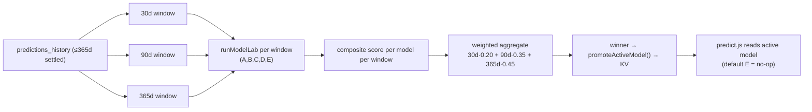

# Auto Model Selection

**Date:** 2026-07-18
**Purpose:** Make every model compete over multiple time windows and **automatically promote the best one** — no manual switching.

> Builds on the Model Laboratory (`MODEL_LAB.md`). Selection is evaluated from real settled history; promotion is persisted to KV and consulted by the live prediction path. **Safe by default:** if no model clears the sample floor, the selector keeps model **E (everything enabled)** — identical to current production.

---

## How it works



1. Load up to 365 days of settled predictions once.
2. Slice into **30 / 90 / 365-day** windows.
3. Run the full Model Lab (models **A–E**) per window → Accuracy, ROI, LogLoss, Brier, EV.
4. Score each model per window, aggregate across windows, promote the winner.

---

## Competing models

The five Model Lab configurations all compete:

| ID | Model |
|----|-------|
| A | Poisson |
| B | Poisson + Elo |
| C | Poisson + Elo + xG |
| D | Poisson + xG + Injuries |
| E | Everything enabled |

---

## Scoring

**Per window** (min-max normalized across models within that window):

```
score = 0.50·ROI + 0.20·Accuracy + 0.20·(−LogLoss) + 0.10·EV
```

**Across windows** (weighted, recency + stability):

```
composite = (0.20·score₃₀ + 0.35·score₉₀ + 0.45·score₃₆₅) / Σ(weights of eligible windows)
```

- **Sample floor:** a model must have ≥ `MODEL_SELECT_MIN_SAMPLES` (default **20**) settled bets in a window to be eligible there.
- The winner is the highest weighted composite among models eligible in at least one window.
- If none qualify → default to **E** (`reason: insufficient_data_default`).

---

## Promotion & live application

- **Promotion** writes `footy_active_model` to KV: `{ id, name, promotedAt, compositeScore, windowWinners, totalSettled }` (`promoteActiveModel`).
- **Live read:** `predict.js` calls `getActiveModelId()` once per request (env override `ACTIVE_MODEL_ID` wins; else KV; else `E`).
- **Application:** for each fixture, if the active model isn't `E`, `predict.js` rebuilds that model's 1X2 from the same live sources the lab uses (Poisson `pRaw`, Elo probs, xG λ, market Shin, injuries factor) via the shared `blendModel()` and **overrides the final probabilities** used for pick selection. Model `E` (default) is a **no-op** — the full calibration + stacker + market stack is preserved.
- Result is surfaced as `modelMeta.activeModel` on every prediction.

**No manual switching:** promotion happens on a cron and is consumed automatically by prediction.

---

## Automation (cron)

`vercel.json`:

```
/api/cron/daily-ml?mode=model-selection   →  35 3 * * *   (daily)
```

The cron loads settled history, runs the competition, and promotes the winner. Reuses the existing `daily-ml` function (Hobby 12-function limit).

---

## API

```
GET  /api/backtest?view=model-select          → active model + latest competition (open, read-only)
GET  /api/backtest?view=model-select&run=1     → run + promote now (cron/admin auth)
```

Response (read):

```json
{
  "ok": true,
  "ran": false,
  "active": { "id": "E", "name": "Everything enabled", "promotedAt": "2026-07-18T03:35:…", "compositeScore": 0.71 },
  "selected": { "id": "E", "name": "Everything enabled", "reason": "highest_weighted_composite" },
  "windows": [
    { "key": "30d", "days": 30, "weight": 0.2, "totalSettled": 140, "winner": { "id": "B", "composite": 0.66 } },
    { "key": "90d", "days": 90, "weight": 0.35, "totalSettled": 410, "winner": { "id": "E", "composite": 0.74 } },
    { "key": "365d", "days": 365, "weight": 0.45, "totalSettled": 1600, "winner": { "id": "E", "composite": 0.78 } }
  ],
  "ranking": [ { "id": "E", "compositeScore": 0.75, "coverage": 1.0 }, … ]
}
```

Client: `loadModelSelection()` in `src/services/backtestService.ts`.

---

## UI

The **Model Laboratory** panel shows an **Auto-promoted model** banner (id · name · promotion date) and each window's winner, above the per-model metrics table.

---

## Configuration

| Env | Default | Purpose |
|-----|---------|---------|
| `ACTIVE_MODEL_ID` | — | Hard override of the promoted model (ops kill-switch, e.g. `E`) |
| `MODEL_SELECT_MIN_SAMPLES` | 20 | Per-window eligibility floor |

Window set and weights live in `AutoModelSelection.js` (`WINDOWS`).

---

## Verification

- `node --test tests/math.test.js` → **62 pass** (adds `blendModel` normalization/injury-tilt test + an Auto Model Selection window-competition test).
- `npm run build` → frontend compiles with the promotion banner.
- `node --check` on `predict.js`, `backtest.js`, `daily-ml.js`, `AutoModelSelection.js` → OK.

## Files

| File | Change |
|------|--------|
| `server-utils/modelLab/ModelLab.js` | Export pure `blendModel()` + `getModelById()` |
| `server-utils/modelLab/AutoModelSelection.js` | **New** windows competition, composite scoring, KV promotion |
| `api/backtest.js` | **New** `view=model-select` (read + authed run) |
| `api/cron/daily-ml.js` | **New** `mode=model-selection` |
| `vercel.json` | Daily model-selection cron |
| `api/predict.js` | Read active model, apply via `blendModel` (default E = no-op), expose `modelMeta.activeModel` |
| `src/types.ts`, `backtestService.ts`, `ModelLabPanel.tsx` | Types, loader, promoted-model banner |
| `tests/math.test.js` | Selection + blend tests |

*Selection is automatic and reversible: `ACTIVE_MODEL_ID=E` (or an empty store) restores the full-stack default instantly.*
