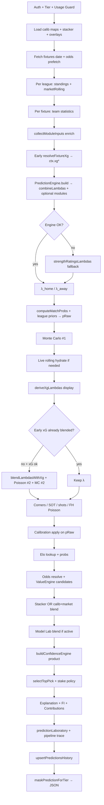
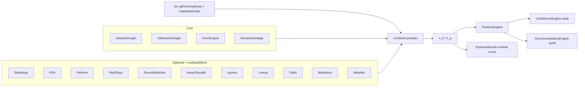
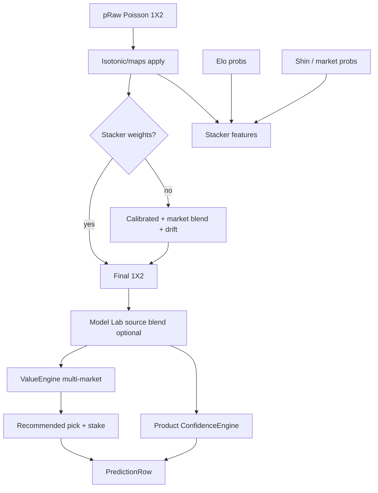
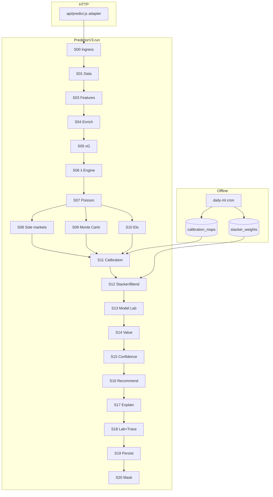

# Predictor V3 — Architecture Specification

| Field | Value |
|-------|-------|
| **Document** | `PREDICTOR_V3_ARCHITECTURE.md` |
| **Date** | 2026-07-18 |
| **Status** | Architecture only — **no implementation in this document** |
| **Authors** | Lead AI Architect · Principal Quant Engineer |
| **Baseline** | Predictor V2.1 (`server-utils/pipeline/PredictorV2.js`) + live `api/predict.js` |
| **Constraint** | Preserve **every** existing feature; backward-compatible migration; no simplification of working math |

> **Mandate:** Analyze the current prediction pipeline, expose structural debt, then design Predictor V3 as a modular stage graph that *contains* today’s capabilities rather than replacing them.

---

# STEP 1 — Current Pipeline Inventory

## 1.1 What “Predictor V2” actually is

`PredictorV2` (`server-utils/pipeline/PredictorV2.js`) is a **contract + helpers module**, not a full orchestrator.

| Export | Role |
|--------|------|
| `PREDICTOR_V2_VERSION` / `PIPELINE_STAGES` | Named stage list for audit |
| `blendLambdasWithXg` | Late λ blend when early xG missed |
| `resolveFixtureXg` / `buildXgSourceProbs` | Rolling xG → λ / Model Lab source |
| `buildPipelineTrace` | `modelMeta.pipeline` payload |

**True orchestrator:** `api/predict.js` (ingress → data → λ → probs → post-λ → persist → mask → response).

**Canonical λ engine:** `server-utils/PredictionEngine/` via façade `server-utils/prediction/PredictionEngine.js`.

---

## 1.2 Module inventory (live)

### Ingress & policy
| Module | Path | Role |
|--------|------|------|
| Predict handler | `api/predict.js` | Auth, tier, rate limit, usage guard, fixture loop, response mask |
| Access / masking | `server-utils/accessTier.js` (via imports in predict) | Tier daily limits, `maskPredictionForTier` |
| Observability | `requestMonitor.js`, `metricsStore.js`, `logger.js` | Request timing / failure bumps |

### Data collection & cache
| Module | Path | Role |
|--------|------|------|
| HTTP + KV cache | `server-utils/fetcher.js` | `getWithCache` for fixtures, stats, standings, enrich endpoints |
| Odds prefetch | `server-utils/oddsPrefetch.js` | Date-batched odds map |
| Market rolling | `server-utils/teamMarketRolling.js` | Corners / SOT / shots / xG rolling rows |
| Live rolling hydrate | `buildLiveRollingForTeam` in `api/predict.js` | Uncached stats → rolling when map thin |
| Module enrich bus | `PredictionEngine/moduleInputs.js` | Odds, H2H, injuries, lineups, recent, rest, weather |
| League params / profiles | `modelConstants.js`, `leagueProfiles/LeagueProfile.js` | ρ, homeAdv, market priors |

### Feature / strength / λ
| Module | Path | Role |
|--------|------|------|
| Attack / Defense / Form / HomeAdv / Away | `PredictionEngine/*.js` | Core factors |
| Standings, H2H, Referee, Rest, Recent, Injuries, Lineup, Odds, Motivation, Weather | same | Optional λ adjustments gated by `modularBlend` |
| Combiner | `PredictionEngine/combine.js` | Weighted λ + early xG blend (`expectedGoals`) |
| Weights | `PredictionEngine/weights.js` | Env + auto-calib overlay |
| Fallback strength | `strengthRatingsLambdas` (math / predict import) | Non-modular λ if engine fails |
| ExpectedGoals (engine) | `PredictionEngine/ExpectedGoals.js` | Module score from λ (diagnostic) |
| Rolling xG model | `server-utils/xg/RollingXgModel.js` | Shot-based xG λ |

### Probabilities & simulation
| Module | Path | Role |
|--------|------|------|
| Poisson + Dixon–Coles | `server-utils/math.js` `computeMatchProbs` / `buildMatchScorePmf` | Analytical 1X2 + markets |
| Engine Poisson | `PredictionEngine/PoissonEngine.js` | Same family inside `build()` (may be superseded by predict.js recalc) |
| Monte Carlo | `monteCarlo/MonteCarloEngine.js` | Adaptive 1k–25k sims from PMF |
| League market priors | `applyLeagueMarketPriors` | Draw / BTTS / over overlays |
| Side markets | predict.js `buildPoissonMarketBlock` + `deriveMarketLambdas` | Corners, SOT, shots |
| First half | `deriveFirstHalfLambdas` + second `computeMatchProbs` | FH 1X2 / GG / O-lines |

### Post-λ probability stack
| Module | Path | Role |
|--------|------|------|
| Calibration apply | `isotonicCalibration.js` | Per-league maps (any method materialized as curves) |
| Calibration train | `calibration/CalibrationSelector.js`, `methods.js`, `api/cron/daily-ml.js` | Isotonic / Platt / Temp / Beta bake-off |
| Auto-calib overlays | `calibration/overlayRuntime.js` | Weight overlays for prediction weights |
| Elo | `teamElo.js` | Parallel 1X2 source + stacker feature |
| Stacker | `mlStacker.js` (+ daily-ml fit) | Multinomial blend over features |
| Model Lab blend | `modelLab/ModelLab.js`, `AutoModelSelection.js` | A–E model sources / active id |

### Decision & explain
| Module | Path | Role |
|--------|------|------|
| ValueEngine | `value/ValueEngine.js` | Multi-market EV / Kelly / recommendable gate |
| Confidence (product) | `confidence/ConfidenceEngine.js` | Dimensional 0–100 explain block |
| Confidence (engine audit) | `PredictionEngine/ConfidenceEngine.js` | Module-average diagnostic — **does not drive UI pick** |
| Recommendation (product) | `selectTopPick` + value path in `api/predict.js` | Authoritative pick |
| Recommendation (engine audit) | `PredictionEngine/RecommendationEngine.js` | Soft pick from raw Poisson — **audit only** |
| Explanation | `explanation/PredictionExplanation.js` | Reason codes / narrative |
| Feature Importance | `importance/FeatureImportanceEngine.js` | Contribution % vector |
| Prediction Contributions | `importance/PredictionContributions.js` | Signed lift chart |
| Prediction Laboratory | `predictionLaboratory/PredictionLaboratory.js` | Lab summary on row |

### Persist & offline
| Module | Path | Role |
|--------|------|------|
| History upsert | `predictionsHistory.js` | Persist rows for backtest / ML |
| Feature importance rows | `persistFeatureImportance.js` | Optional FI persistence |
| Daily ML cron | `api/cron/daily-ml.js` | Calibration maps + stacker weights |
| Feature extractor (ML) | `ml/features/FeatureExtractor.js` | Offline / stacker features |

---

# STEP 2 — Dependency Graphs

## 2.1 Documented / intended flow (V2 narrative)

```text
Data Collection
    ↓
Feature Extraction
    ↓
xG
    ↓
Elo
    ↓
Lambda Generation
    ↓
Poisson
    ↓
Monte Carlo
    ↓
Calibration
    ↓
Stacker
    ↓
Confidence
    ↓
Recommendation
    ↓
Persist
    ↓
Response
```

## 2.2 Physical flow today (`api/predict.js`) — as executed



## 2.3 λ subgraph (PredictionEngine)



## 2.4 Probability stack subgraph (post-λ)



---

# STEP 3 — Structural Findings

## 3.1 Duplicated logic

| Duplication | Where | Risk |
|-------------|-------|------|
| **Two Confidence engines** | `PredictionEngine/ConfidenceEngine` vs `confidence/ConfidenceEngine` | Name collision; only product engine ships on row; audit scores buried in `moduleScores` |
| **Two Recommendation paths** | Engine soft pick vs `selectTopPick` + ValueEngine in predict | Engine pick never authoritative — easy to confuse in docs/UI |
| **xG blend twice** | Early in `combineLambdas` + late `blendLambdasWithXg` | Correct if early missed; path branching complexity |
| **Poisson PMF twice+** | Engine `PoissonEngine` + predict `computeMatchProbs` (+ recalc on late xG) + FH pass + MC builds PMF again | CPU; engine Poisson often discarded |
| **ExpectedGoals naming** | Engine module vs `RollingXgModel` | Different semantics (score vs λ source) |
| **Weights façades** | `prediction/predictionWeights` history vs `PredictionEngine/weights.js` | Historical overlap risk if imports diverge |
| **1X2 margin heuristics** | Engine RecommendationEngine vs product confidence / stake buckets | Parallel “confidence” languages |

## 3.2 Dead / low-signal code (keep for compatibility, mark clearly)

| Item | Note |
|------|------|
| Engine `RecommendationEngine` output | Explicitly audit-only; not used for `recommended.pick` |
| Engine `ConfidenceEngine` overall | Does not set `recommended.confidence` |
| Predictor V2 stage list order | Injuries…Motivation listed *after* Poisson in contract; physically inside engine *before* Poisson |
| `backups/prediction-engine-*` | Snapshot only — not on serve path |
| Weather / lineup “key player” signals | Often neutral when upstream empty — live modules, weak information |

**V3 rule:** Do not delete these surfaces; re-home them as named stages with `status: skipped|neutral|ok`.

## 3.3 Unnecessary passes / double calculation

1. **Monte Carlo may run twice** when late xG blend triggers (`runMc()` then again after recalc).
2. **`computeMatchProbs` may run twice** for the same fixture on late xG path.
3. **PMF built in MC** after analytical Poisson already materialized markets — intentional for CIs, but can share one PMF object.
4. **Elo `await` per fixture** inside the loop — serial I/O bottleneck vs batchable ratings.
5. **`collectModuleInputs`** can fan out multiple upstream calls per fixture (H2H, injuries, lineups, recent×2) even when KV-warm — latency cliff on cold leagues.
6. **Model Lab / stacker / calibration** all transform 1X2 — order is fixed but intermediate triples are recomputed into several row fields (`evaluation.*`).

## 3.4 Bottlenecks

| Bottleneck | Severity | Notes |
|------------|----------|-------|
| Per-fixture enrich HTTP | High | Dominant cold-path cost |
| Adaptive MC up to 25k | Medium | Justified on toss-ups; wasteful if PMF rebuilt twice |
| `api/predict.js` size / single function | High (ops) | Hard to test, hard to reason about stage failures |
| Live rolling hydrate budget | Medium | Caps uncached stats; degraded markets when exhausted |
| Serverless duration / Hobby function count | Medium | Already constrains new routes |

## 3.5 Coupling

- **God handler coupling:** Ingress, data, quant, ML, UX fields, persistence, and tier masking in one file.
- **Context bag coupling:** `engineCtx` / `confidenceCtx` spread of `moduleInputs` — every module reads a shared unstructured object.
- **Version coupling:** `MODEL_VERSION` ties calibration maps, stacker, overlays, and history.
- **UI contract coupling:** Row shape assumed by MatchModal / laboratory / FI charts — V3 must keep field names.

## 3.6 Wrong / misleading execution order

| Claim (V2 docs) | Reality |
|-----------------|--------|
| Elo before λ | Elo is **after** Poisson (and after calibration apply start); used for stacker / Model Lab, not λ |
| Monte Carlo after full post-λ stack | MC runs on **λ** early (pre-calibration); does not resample calibrated probs |
| Injuries after Poisson | Injuries (etc.) adjust **λ before** Poisson inside engine |
| Single Poisson | Late xG can force second Poisson + MC |

These are not necessarily *wrong mathematically*, but the **contract order ≠ physical order**, which blocks safe refactors.

## 3.7 Train / serve inconsistencies (P0 quant)

| Issue | Train (`daily-ml.js`) | Serve (`predict.js`) |
|-------|----------------------|----------------------|
| Calibration targets | `extractRawTriple` **prefers** `evaluation.modelProbs1x2Pct` (final displayed) | Apply maps to **raw Poisson** `pRaw` |
| Stacker features | Fit using triples from same extractor preference | Features built from raw/calib/elo/market at serve |
| Result | Maps/stacker trained on **post-processed** probs can be applied to **pre-processed** probs → silent skew | |

**V3 must preserve both code paths until a dual-key migration ships** (`rawPoissonProbs1x2Pct` already exists on evaluation for honesty — training must prefer it).

---

# STEP 4 — Predictor V3 Design

## 4.1 Design principles

1. **Preserve every feature** — all markets, engines, audit fields, Model Lab, laboratory, MC, FI, contributions, history, tier mask.
2. **Orchestrator is a stage graph** — `api/predict.js` becomes a thin HTTP adapter over `PredictorV3.run(fixtureCtx)`.
3. **One stage = one contract** — typed Input / Output / Failure; no silent dual writers to `recommended.pick`.
4. **Physical order = documented order** — audit `pipeline.stages` mirrors runtime.
5. **Backward compatibility** — same JSON field names; `modelMeta.predictorVersion: "predictor-v3.x"`; V2 helpers remain importable.
6. **No math rewrites** — extract and call existing modules; fix *wiring* and *ordering*, not Dixon–Coles formulas.
7. **Train/serve alignment** as a first-class stage concern — not a cron footnote.

## 4.2 Target execution order (V3)

```text
S00 IngressPolicy
S01 DataCollection
S02 CacheResolve
S03 FeatureExtraction
S04 EnrichmentBus          ← moduleInputs (parallel)
S05 XgResolve              ← rolling xG λ (must complete before λ combine)
S06 LambdaGeneration       ← PredictionEngine.build / fallback
S07 PoissonCore            ← computeMatchProbs + league priors → pRaw
S08 SideMarkets            ← corners / SOT / shots / FH (λ derivatives)
S09 MonteCarlo             ← once, on final λ (share PMF with Poisson if possible)
S10 EloResolve             ← parallel ratings (batchable)
S11 CalibrationApply       ← maps on pRaw only
S12 StackerOrMarketBlend   ← ML stacker or calib+market
S13 ModelLabBlend          ← optional A–E
S14 ValueEngine
S15 ConfidenceProduct      ← server-utils/confidence
S16 RecommendationProduct  ← selectTopPick + stake + value gate
S17 ExplainBundle          ← explanation + FI + contributions + engine audit scores
S18 Laboratory + PipelineTrace
S19 Persist
S20 TierMask + Response
```

**Intentional V3 order fixes vs today:**
- xG fully resolved **before** λ finalize (early + late hydrate folded into S05 with single blend).
- Monte Carlo **once** after final λ (after late hydrate), before calibration.
- Elo may run in parallel with SideMarkets / after Poisson, but **before** stacker features are frozen.
- Calibration always consumes **raw** Poisson; train must match.

## 4.3 Stage specifications

Latency estimates assume warm KV, one mid-tier league fixture, adaptive MC ~5k. Cold enrich can 2–10×.

---

### S00 — IngressPolicy

| | |
|--|--|
| **Input** | HTTP req, bearer, query (date, leagues, limit) |
| **Output** | `TierContext`, usage budget, `effectiveLimit`, auth identity |
| **Responsibilities** | Auth, anonymous rate limit, tier resolve, DB-only degrade under quota |
| **Dependencies** | Supabase admin, access tiers, usage snapshot |
| **Est. latency** | 20–80 ms |
| **Failure** | 401/403/429; never invent Ultra; fail closed on auth errors |

---

### S01 — DataCollection

| | |
|--|--|
| **Input** | date, leagueIds, season |
| **Output** | fixtures[], standings by league, odds prefetch map |
| **Responsibilities** | Upstream `/fixtures`, `/standings`, batched odds |
| **Dependencies** | `fetcher.getWithCache`, `prefetchOddsByDate` |
| **Est. latency** | 80–400 ms (batch) |
| **Failure** | 502 on fixtures; standings empty → continue with degraded context; odds miss → per-fixture fallback |

---

### S02 — CacheResolve

| | |
|--|--|
| **Input** | endpoint keys |
| **Output** | cached JSON or miss |
| **Responsibilities** | KV TTL policy, legacy key dual-read |
| **Dependencies** | `fetcher.js` |
| **Est. latency** | 1–15 ms hit / included in S01 miss |
| **Failure** | Treat miss as fetch; never crash predict |

---

### S03 — FeatureExtraction

| | |
|--|--|
| **Input** | team ids, league, season, standings rows |
| **Output** | `hStats`/`aStats`, form strings, FH fractions, teamContext |
| **Responsibilities** | Normalize `/teams/statistics`, averages, form multipliers |
| **Dependencies** | math helpers in predict / shared normalizers |
| **Est. latency** | 40–200 ms (2 stats calls, warm) |
| **Failure** | Emit `insufficientData` row; still attach standings/form if any |

---

### S04 — EnrichmentBus

| | |
|--|--|
| **Input** | fixtureId, team ids, odds blob, fx payload |
| **Output** | `moduleInputs` (odds, h2h, injuries, lineups, recent, rest, weather) |
| **Responsibilities** | Parallel env-gated fetches; fail-safe undefined |
| **Dependencies** | `moduleInputs.js` |
| **Est. latency** | 30–500 ms (cold fan-out) |
| **Failure** | Neutral modules; log warn; never abort λ |

---

### S05 — XgResolve

| | |
|--|--|
| **Input** | marketRolling rows (or live hydrate), leagueAvg, home/away adv |
| **Output** | `xgHome`/`xgAway`, sample meta, `xgSource` |
| **Responsibilities** | Single xG resolution including live rolling hydrate; no second surprise blend later |
| **Dependencies** | `RollingXgModel`, `teamMarketRolling`, live hydrate helper |
| **Est. latency** | 5–50 ms warm; +hydrate budget when thin |
| **Failure** | `xg: skipped`; λ proceeds without `expectedGoals` blend |

---

### S06 — LambdaGeneration

| | |
|--|--|
| **Input** | stats, form, standings, moduleInputs, xg*, weights, shrinkageK |
| **Output** | `lambdaHome`/`lambdaAway`, `strengthMeta`, `moduleScores`, `method` |
| **Responsibilities** | `PredictionEngine.build`; fallback `strengthRatingsLambdas`; preserve all module math |
| **Dependencies** | `PredictionEngine/*`, `combine.js`, `weights.js` |
| **Est. latency** | 1–8 ms CPU |
| **Failure** | Fallback strength; if still bad → insufficientData row |

---

### S07 — PoissonCore

| | |
|--|--|
| **Input** | final λ, ρ, correlation, leagueParams |
| **Output** | `calc`, `p` (priors applied), **`pRaw` immutable for calib** |
| **Responsibilities** | Bivariate Poisson + Dixon–Coles; league market priors on display markets |
| **Dependencies** | `math.computeMatchProbs`, `applyLeagueMarketPriors` |
| **Est. latency** | 1–5 ms |
| **Failure** | Skip fixture (`continue`); no invented probs |

---

### S08 — SideMarkets

| | |
|--|--|
| **Input** | rolling rows, λ full, FH fractions |
| **Output** | corners, sot, shotsTotal, firstHalf blocks |
| **Responsibilities** | Existing Poisson line grids; FH λ scale |
| **Dependencies** | `deriveMarketLambdas`, `buildPoissonMarketBlock`, FH helpers |
| **Est. latency** | 2–10 ms |
| **Failure** | Null blocks; UI lock chips unchanged |

---

### S09 — MonteCarlo

| | |
|--|--|
| **Input** | final λ, fixtureId, correlation, ρ; optional shared PMF from S07 |
| **Output** | `monteCarlo` adaptive sims + CIs |
| **Responsibilities** | Exactly **one** MC per fixture on final λ; adaptive tiers 1k–25k |
| **Dependencies** | `MonteCarloEngine` |
| **Est. latency** | 5–80 ms (tier-dependent) |
| **Failure** | `monteCarlo: null`; analytical markets remain |

---

### S10 — EloResolve

| | |
|--|--|
| **Input** | leagueId, home/away team ids |
| **Output** | `eloInfo` { ratings, spread, thin, probs } |
| **Responsibilities** | Parallel probability source; stacker/Model Lab feature |
| **Dependencies** | `teamElo.js` |
| **Est. latency** | 5–40 ms (target: batch per league in V3 impl) |
| **Failure** | `elo: unavailable`; stacker omits spread |

---

### S11 — CalibrationApply

| | |
|--|--|
| **Input** | `pRaw` (0–1), league calibration maps |
| **Output** | calibrated triple, `calibrationApplied`, method meta |
| **Responsibilities** | Apply stored curves only to **raw** Poisson; never to final stacker output |
| **Dependencies** | `isotonicCalibration.applyCalibratedTriple` |
| **Est. latency** | &lt;1 ms |
| **Failure** | Identity pass-through; flag `skipped` |

---

### S12 — StackerOrMarketBlend

| | |
|--|--|
| **Input** | calibrated probs, elo, market, features |
| **Output** | `modelProbs1x2`, `stackerApplied`, reason codes |
| **Responsibilities** | Existing `applyStacker` or calib+market blend + drift penalty |
| **Dependencies** | `mlStacker.js`, market Shin helpers |
| **Est. latency** | &lt;2 ms |
| **Failure** | Fall back to calibrated or raw; never empty 1X2 |

---

### S13 — ModelLabBlend

| | |
|--|--|
| **Input** | source triples (poisson, elo, xg, market…), `activeModelId` |
| **Output** | optional blended 1X2 |
| **Responsibilities** | Preserve Auto Model Selection behavior |
| **Dependencies** | `ModelLab.js`, `AutoModelSelection.js`, `buildXgSourceProbs` |
| **Est. latency** | &lt;2 ms |
| **Failure** | Keep S12 output; stage `skipped` |

---

### S14 — ValueEngine

| | |
|--|--|
| **Input** | odds ladder, model probs (all markets available) |
| **Output** | `valueEngine`, best markets, EV/Kelly |
| **Responsibilities** | Full multi-market professional value; negative-EV hard gate |
| **Dependencies** | `ValueEngine.js`, `valueMarkets.js` |
| **Est. latency** | 1–5 ms |
| **Failure** | Empty engine object (already used today) |

---

### S15 — ConfidenceProduct

| | |
|--|--|
| **Input** | `confidenceCtx` (stats, modules, xg, referee…) + final probs context |
| **Output** | `confidenceEngine` dimensional scores |
| **Responsibilities** | Product explainability; **must not** mutate λ or pick |
| **Dependencies** | `confidence/ConfidenceEngine.js` |
| **Est. latency** | 1–3 ms |
| **Failure** | Minimal engine with referee-only dims |

---

### S16 — RecommendationProduct

| | |
|--|--|
| **Input** | final probs, valueEngine, confidence, risk/stake policy, cooldown |
| **Output** | `recommended`, stake bucket, reasonCodes |
| **Responsibilities** | Sole writer of `recommended.pick` / stake; keep selectTopPick + value gate + stakePolicyV2 |
| **Dependencies** | predict helpers (to be extracted, not rewritten) |
| **Est. latency** | &lt;2 ms |
| **Failure** | No-bet / empty pick with reasonCodes |

---

### S17 — ExplainBundle

| | |
|--|--|
| **Input** | moduleScores, elo, calib/stacker flags, contributions inputs |
| **Output** | `explanation`, `featureImportance`, `predictionContributions`, engine audit scores |
| **Responsibilities** | Attach all explain surfaces; persist FI optional |
| **Dependencies** | Explanation, FI, Contributions engines |
| **Est. latency** | 2–8 ms |
| **Failure** | Omit optional blocks; keep prediction |

---

### S18 — Laboratory + PipelineTrace

| | |
|--|--|
| **Input** | full row draft + stage flags |
| **Output** | `predictionLaboratory`, `modelMeta.pipeline`, `predictorVersion` |
| **Responsibilities** | V3 audit summary; stage statuses |
| **Dependencies** | `PredictionLaboratory`, `buildPipelineTrace` (extended for V3) |
| **Est. latency** | &lt;2 ms |
| **Failure** | Minimal meta with version |

---

### S19 — Persist

| | |
|--|--|
| **Input** | persistable rows |
| **Output** | upsert stats |
| **Responsibilities** | `upsertPredictionsHistory`; keep raw_payload with **raw + final** triples |
| **Dependencies** | Supabase |
| **Est. latency** | 30–150 ms batch |
| **Failure** | Log + still return predictions (current soft-fail posture) |

---

### S20 — TierMask + Response

| | |
|--|--|
| **Input** | rows, TierContext |
| **Output** | HTTP JSON |
| **Responsibilities** | `maskPredictionForTier`; headers X-Tier / counts |
| **Dependencies** | access tiers |
| **Est. latency** | &lt;5 ms |
| **Failure** | Prefer mask over leak |

---

## 4.4 Dual engines under V3 naming (preserved)

| Name | Stage | Role |
|------|-------|------|
| `ConfidenceAudit` | inside S06 moduleScores | Existing PredictionEngine ConfidenceEngine |
| `ConfidenceProduct` | S15 | Existing product ConfidenceEngine |
| `RecommendationAudit` | inside S06 moduleScores | Existing engine RecommendationEngine |
| `RecommendationProduct` | S16 | Existing selectTopPick + Value gate |

No removal — only **disambiguation** in pipeline trace.

## 4.5 Offline / train alignment (stage-adjacent)

| Offline job | Must read | Must write |
|-------------|-----------|------------|
| Calibration fit | Prefer `evaluation.rawPoissonProbs1x2Pct` | Maps keyed by league + modelVersion + outcome + method |
| Stacker fit | Features reconstructed like S12 serve path | Weights map |
| Auto model promote | Existing Model Lab metrics | `activeModelId` |

V3 migration includes a **compatibility reader** that accepts old payloads (final probs) but logs `train_skew_legacy_payload` until history refreshes.

---

# STEP 5 — Architecture Package

## 5.1 Package layout (target — not implemented yet)

```text
server-utils/pipeline/
  PredictorV2.js              ← KEEP (compat helpers + version)
  PredictorV3.js              ← NEW facade: version, stage ids, run()
  stages/
    S00_IngressPolicy.js      ← extract from predict.js
    S01_DataCollection.js
    ...
    S20_TierMask.js
  contracts/
    StageContext.js           ← shared bag with frozen snapshots
    StageResult.js
api/predict.js                ← thin: parse → PredictorV3.run → res.json
```

Existing engines stay in place (`PredictionEngine/`, `monteCarlo/`, `value/`, …). Stages **call** them.

## 5.2 Complete system diagram



## 5.3 Migration strategy

### Phase 0 — Freeze contract (docs only) ✅ this document
- Inventory complete; no behavior change.

### Phase 1 — Extract without behavior change
1. Move pure helpers from `api/predict.js` into `pipeline/stages/*` **byte-equivalent** call order.
2. `PredictorV3.run` initially **delegates** to the same sequence as today (including known double MC) behind flag `PREDICTOR_V3=0` default.
3. Golden fixtures: snapshot N prediction rows (hashes of λ, pRaw, final 1X2, pick, markets).

### Phase 2 — Order normalization (flag `PREDICTOR_V3=1`)
1. Collapse xG to S05; eliminate second Poisson/MC except when λ actually changes.
2. Share PMF between PoissonCore and MonteCarlo.
3. Pipeline trace stage ids = S00…S20.
4. Compare golden hashes; allow λ-equal MC seed stability tests.

### Phase 3 — Train/serve fix (flag `ML_RAW_POISSON_TRAIN=1`)
1. `extractRawTriple` prefers `rawPoissonProbs1x2Pct`.
2. Refit calibration + stacker on history.
3. Keep legacy fallback for old payloads.
4. Backtest KPI gate before promoting maps to production.

### Phase 4 — Performance
1. Batch Elo per league.
2. Parallelize enrich with explicit concurrency cap.
3. Optional skip MC when `tier` free / mask would strip (policy decision — **default keep MC for Ultra/admin** to preserve features).

### Phase 5 — Deprecate confusion (not code deletion)
1. Rename in **trace only**: `ConfidenceAudit` / `RecommendationAudit`.
2. Keep files and exports for import compatibility.
3. Update reports (`PREDICTOR_V2_REPORT` → addendum pointing to V3).

**Rollback:** `PREDICTOR_V3=0` restores V2 physical path; V2 helpers remain.

## 5.4 Risk analysis

| Risk | Impact | Likelihood | Mitigation |
|------|--------|------------|------------|
| Silent pick drift during extract | Critical | Medium | Golden fixture hashes; shadow mode |
| Train/serve fix changes maps abruptly | High | High | Dual-write maps; gradual promote; backtest gate |
| Stage split mistakes optional modules | High | Medium | Keep `PredictionEngine.build` intact as S06 black box initially |
| Latency regression from “cleaner” awaits | Medium | Medium | Benchmark warm/cold before/after |
| UI breaks on field rename | High | Low if forbidden | **No response field renames in V3.0** |
| Double-counting xG during transition | Medium | Medium | Single `xgBlend.applied` latch in context |
| Serverless size / cold start | Medium | Low | Stages as separate files tree-shaken; avoid new heavy deps |

## 5.5 Compatibility matrix

| Artifact | V2 | V3.0 |
|----------|----|------|
| `recommended.*` | ✓ | ✓ identical semantics |
| `probs.*` markets | ✓ | ✓ |
| `monteCarlo` | ✓ | ✓ (once on final λ) |
| `valueEngine` / `confidenceEngine` | ✓ | ✓ |
| `featureImportance` / contributions | ✓ | ✓ |
| `modelMeta.pipeline` | v2.1 stages | v3 stages (superset + aliases) |
| `evaluation.rawPoissonProbs1x2Pct` | ✓ | ✓ required for ML |
| `PredictorV2` imports | ✓ | ✓ kept |
| Cron daily-ml | ✓ | ✓ with raw-prefer extractor |

## 5.6 Success criteria (when implementation is later authorized)

1. All existing markets and engines still populate on Ultra rows.
2. Golden set: λ and `pRaw` match within float tolerance; pick equal on ≥99% fixtures (document intentional diffs).
3. Calibration training uses raw Poisson; serve QC shows reduced ECE vs skewed baseline.
4. Average MC invocations per fixture = 1.
5. `api/predict.js` &lt; ~300 lines adapter (logic in stages).
6. No removal of Model Lab, laboratory, FI, contributions, side markets, FH, stake policy, or tier mask.

---

# Appendix A — Current vs V3 stage mapping

| V2 contract name | Physical today | V3 stage |
|------------------|----------------|----------|
| fetch | fixtures + odds | S01 |
| cache | getWithCache | S02 |
| features | team stats | S03 |
| predictionEngine | build + optional | S04+S06 |
| poisson | computeMatchProbs | S07 |
| elo | after calib start | S10 |
| xg | early + late | S05 |
| injuries…motivation | inside engine | S04→S06 |
| calibration | apply maps | S11 |
| confidence | product engine | S15 (+ audit in S06) |
| recommendation | selectTopPick+value | S16 (+ audit in S06) |
| featureImportance | FI+contrib | S17 |
| prediction | row+lab | S18–S20 |
| *(unnamed)* Monte Carlo | mid-loop | S09 |
| *(unnamed)* stacker | mid-loop | S12 |
| *(unnamed)* Model Lab | mid-loop | S13 |
| *(unnamed)* persist | end | S19 |

---

# Appendix B — Explicit non-goals for V3.0

- No new scoring model (no replacement of Dixon–Coles).
- No deletion of weak modules (weather/lineup/motivation stay).
- No UI redesign in this architecture workstream.
- No security hardening scope here (tracked in `FINAL_ENTERPRISE_AUDIT_2026.md`) — but V3 must not widen anonymous surface.
- No “simplify to fewer markets.”

---

# Appendix C — Decision log (architecture)

| Decision | Choice | Rationale |
|----------|--------|-----------|
| Orchestrator | Stage graph over PredictorV2 helpers | V2 is contract-only; predict.js needs extraction |
| λ engine | Keep `PredictionEngine.build` as S06 unit | Avoid rewriting module math |
| MC placement | After final λ, before calibration | Matches what CIs mean; removes double run |
| Elo placement | After Poisson, before stacker | Elo is not a λ input today — preserve semantics |
| Calib input | Always raw Poisson | Fixes train/serve when cron aligned |
| Dual confidence/recommend | Keep both, rename in trace | Preserve features + clarity |

---

**End of architecture specification.**  
Implementation requires an explicit follow-up mandate; this document alone must not be treated as authorization to change production code.
