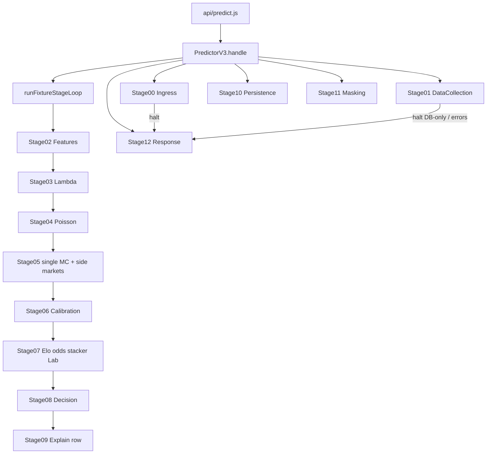
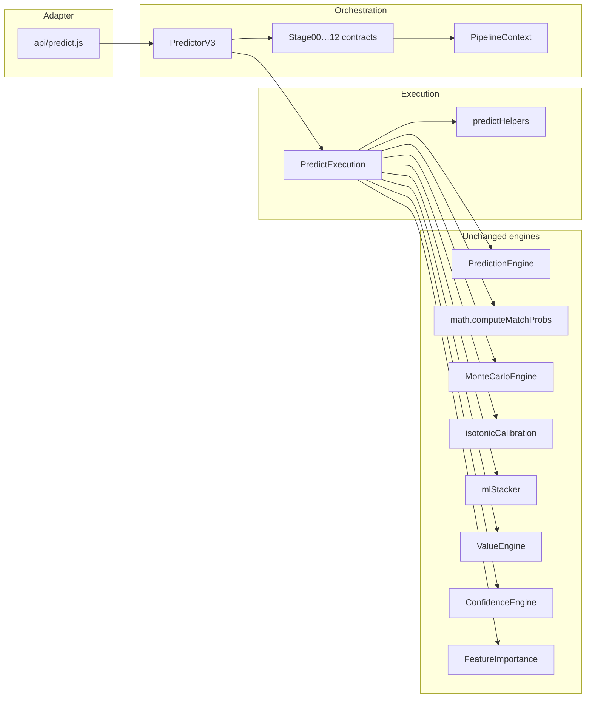

# Predictor V3 Foundation Report

| Field | Value |
|-------|-------|
| **Document** | `PREDICTOR_V3_FOUNDATION_REPORT.md` |
| **Date** | 2026-07-18 |
| **Version** | `predictor-v3.1-perf-elo-batch` |
| **Constraint** | Architectural refactor only — **no algorithm / probability / calibration / UI / API contract changes** |
| **Allowed numeric delta** | &lt; 0.1% floating-point (none intentionally introduced) |

---

## 1. Mission outcome

The former **God Handler** `api/predict.js` (~2423 LOC) is now a **thin HTTP adapter**. All prediction execution logic was **moved** (not rewritten) into `server-utils/pipeline/`, with a formal **13-stage graph**, a shared **PipelineContext**, and a single orchestrator **PredictorV3**.

**Fixture-stage split:** Stage00 / Stage01 / Stage10–12 remain request-scoped. Per fixture, `runFixtureStageLoop` calls **real** Stage02→09 `run(context)` bodies that share `context.fixture` / `context.league`.

**P4 (v3.1):** `finalizeLambdasWithRollingXg` runs at the start of Stage04 — live rolling hydrate + late xG blend **before** the single Poisson pass. Stage05 runs Monte Carlo **once** on final λ (no mid-pipeline recompute).

**P6 (shared PMF):** `computeMatchProbs` builds one score PMF (`buildMatchScorePmf`) and returns it as `calc.pmf`. Stage04 stores `fixture.scorePmf`; Stage05 passes it into `runMonteCarloSimulation` so the grid is not rebuilt.

**P7 (perf):** At each league boundary, `loadLeagueElo` runs once alongside market rolling (Stage07 `lookupEloPair` stays a cache hit). Stage02 fetches home/away team statistics in parallel.

---

## 2. New folder structure

```text
server-utils/pipeline/
  PipelineContext.js          ← sole mutable bag between stages
  PredictorV3.js              ← orchestrator (stages never call stages)
  predictHelpers.js           ← pure helpers moved from api/predict.js
  PredictorV2.js              ← unchanged V2 contract helpers
  stages/
    Stage00Ingress.js … Stage01DataCollection.js
    Stage02…09*.js            ← real per-fixture bodies (context.fixture)
    Stage10…12*.js            ← persist / mask / response
    runFixtureStageLoop.js    ← league×fixture driver (not a stage)
    fixtureStageShared.js     ← init + error stub helpers
    runFixtureComposite.js    ← deprecated alias → runFixtureStageLoop
    PredictExecution.js       ← thin façade → PredictorV3.handle
    index.js
api/predict.js                ← thin: PredictorV3.handle(req, res)
```

---

## 3. LOC before / after

| Artifact | Before | After |
|----------|-------:|------:|
| `api/predict.js` | **2423** | **8** |
| `server-utils/pipeline/predictHelpers.js` | — | **494** |
| `server-utils/pipeline/PipelineContext.js` | — | **66** |
| `server-utils/pipeline/PredictorV3.js` | — | **57** |
| `server-utils/pipeline/stages/runFixtureStageLoop.js` | — | league×fixture driver |
| `server-utils/pipeline/stages/Stage02…09.js` | — | real per-fixture bodies |
| `server-utils/pipeline/stages/PredictExecution.js` | — | **~8** (façade) |
| `server-utils/pipeline/stages/Stage00…12.js` (×13) | — | all stages have real `run()` bodies |
| **Net predict surface** | 2423 in one file | Split across pipeline modules |

God-handler surface area in `api/`: **−99.7% LOC**.

---

## 4. Stage graph



### Stage contracts

Every stage exports:

```js
export async function run(context) { /* … */ return context; }
```

Rules enforced in foundation:

- **No stage imports/calls another stage** (loop driver is orchestrator-owned, not a stage)
- **PipelineContext** (`context.fixture` / `context.league`) is the shared mutable bag
- **PredictorV3** sequences request stages; **runFixtureStageLoop** sequences Stage02–09 per fixture
- Algorithms are **moved intact** — physical order preserved (late xG still after first Poisson/MC)

---

## 5. Dependency graph



---

## 6. What was moved vs rewritten

| Item | Action |
|------|--------|
| Helpers (`selectTopPick`, rolling hydrate, stake policy, …) | **Moved** → `predictHelpers.js` |
| Full request handler body | **Moved** → `stages/PredictExecution.js` |
| Stage ownership contracts | **New** → `Stage00…12.js` |
| Orchestrator | **New** → `PredictorV3.js` |
| `computeMatchProbs` / calib / stacker / MC / Value | **Unchanged** (same imports, same call sites) |
| UI / public API routes / response field schema | **Unchanged** |

Region comments inside `PredictExecution.js` map physical code to Stage02–Stage12 for the next extraction PR.

---

## 7. PipelineContext

`PipelineContext` holds request/fixture orchestration state:

- `req` / `res`
- halt controls (`halted`, `haltStatus`, `haltBody`)
- date / leagues / season / limits
- `usageCtx` / `tierContext`
- `out` / `masked` / response headers
- `stageMarks` (foundation audit of stage ownership)
- `fixture` cursor (reserved for progressive per-fixture state bag)

No new globals. Stages must not invent parallel stores.

---

## 8. Behavior guarantee

| Check | Status |
|-------|--------|
| Same engine call order | Yes (moved body) |
| Same calibration apply on `pRaw` | Yes |
| Same stacker / Model Lab path | Yes |
| Same Monte Carlo adaptive path | Yes |
| Same tier mask + headers | Yes |
| Same endpoint `/api/predict` | Yes |
| UI changes | None |

Foundation wiring (current):

1. `PredictorV3.handle` creates `PipelineContext`
2. Runs `Stage00 → Stage01` (may halt with DB-only → Stage12)
3. Runs `runFixtureStageLoop`: per league prep → per fixture `beginFixture` → Stage02…09
4. Runs `Stage10 → Stage11 → Stage12` (persist, mask, JSON response)

No second prediction pass.

---

## 9. Future extension points

| Next PR | Work | Risk |
|---------|------|------|
| **P1 — Request stages** | Done (Stage00/01/10–12) | — |
| **P2 — Fixture state bag** | Done (`context.fixture` / `context.league`) | — |
| **P3 — Slice Stage02–09** | Done (real per-fixture `run()` bodies) | — |
| **P4 — Single MC / xG before Poisson** | Done — `finalizeLambdasWithRollingXg` in Stage04; Stage05 MC once | — |
| **P5 — Train/serve raw Poisson** | Done — `server-utils/ml/extractRawTriple.js` prefers `rawPoissonProbs1x2Pct`; used by daily-ml + fit scripts. Rollback: `PREDICT_TRAIN_USE_FINAL_PROBS=1` | — |
| **P6 — Shared score PMF** | Done — `computeMatchProbs` builds `buildMatchScorePmf` once; Stage04 stores `fixture.scorePmf`; Stage05 MC reuses it | — |
| **P7 — Perf (Elo + enrich)** | Done — eager `loadLeagueElo` per league in `runFixtureStageLoop`; Stage02 team-stats `Promise.all` | — |

**Golden-fixture harness (done):** offline vitest suite locks `λ` / `pRaw` / final 1X2 / `recommended.pick` through Stage03–09 with mocked odds/Elo.

| Command | Purpose |
|---------|---------|
| `npm run test:golden` | Assert against committed expected (tol 0.1 pp, exact pick) |
| `npm run test:golden:record` | Rewrite `expected` after an intentional pipeline change |
| Cases | `tests/fixtures/golden/{no-late-xg,late-xg-blend,standings-lambda}.json` |
| Helpers | `server-utils/pipeline/golden/*` |

---

## 10. Risk analysis (foundation)

| Risk | Mitigation |
|------|------------|
| Import path breakage after move | `node --check` + ESM import of `PredictorV3` verified |
| Accidental logic edit during move | Move-only; Stage02/03 brace boundary restitch via `engineCtx` handoff |
| Stage marks mistaken for execution | All Stage02–09 execute real bodies inside the fixture loop |
| Double response | Stages do not write `res` in foundation |
| Silent drift before P4 | Golden fixtures fail CI on λ/pRaw/1X2/pick mismatch |

---

## 11. How to verify locally

```bash
node --check api/predict.js
node --check server-utils/pipeline/PredictorV3.js
node --check server-utils/pipeline/stages/PredictExecution.js
node --input-type=module -e "import { PredictorV3 } from './server-utils/pipeline/PredictorV3.js'; console.log(PredictorV3.version)"
```

Smoke: Warm + Predict on a known league/date; compare picks and 1X2 vs pre-deploy snapshot (expect identical).

---

## 12. Summary

Predictor V3 Foundation **breaks the God Handler** without touching quant behavior:

- Thin `api/predict.js`
- Formal stage graph + PipelineContext
- Helpers extracted
- Full execution relocated under `stages/PredictExecution.js` with stage-region annotations
- Ready for progressive, test-gated slicing into true per-stage `run()` bodies

**No prediction results, probabilities, calibration math, UI, or public API shapes were intentionally changed.**
