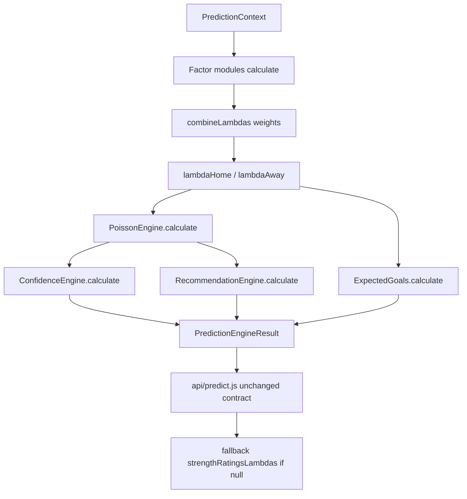

# PredictionEngine — Modular Architecture

**Status:** Production refactor (backwards compatible)  
**Canonical path:** `server-utils/PredictionEngine/`  
**Legacy import path (unchanged):** `server-utils/prediction/PredictionEngine.js` → re-exports canonical engine  
**API / UI contracts:** unchanged (`PredictionEngine.build(ctx)` return shape preserved)

Backup / checkpoint created before this refactor:

- Folder: `backups/prediction-engine-*`
- Git branch: `backup/pre-prediction-engine-modular-*`
- Git tag: `checkpoint/pre-prediction-engine-modular`

---

## Architecture

Every module is independent and exposes:

```ts
calculate(ctx: PredictionContext): {
  score: number;       // typically ~1.0 centered multiplicative factor
  confidence: number;  // 0..1 self-confidence
  details: object;     // diagnostics (includes home/away when relevant)
}
```

`PredictionEngine` (**index**) only:

1. Calls `calculate()` on each module  
2. Passes results to `combine.js` (weighted λ aggregation)  
3. Runs λ-dependent modules (`PoissonEngine`, `ExpectedGoals`, …)  
4. Returns the legacy result shape for `api/predict.js`

**No per-module math lives inside the orchestrator.**

```
                    PredictionContext
                            │
        ┌───────────────────┼───────────────────┐
        ▼                   ▼                   ▼
   AttackStrength     DefenseStrength      FormEngine
   HomeAdvantage      AwayStrength         StandingsEngine
   H2HEngine          RefereeEngine        RestDaysEngine
   RecentMatches      InjuriesEngine*      LineupEngine*
   OddsEngine*        MotivationEngine*    WeatherEngine*
        │                   │                   │
        └───────────────────┼───────────────────┘
                            ▼
                     combine.js  (weights only)
                            │
                     λ_home , λ_away
                            │
              ┌─────────────┼─────────────┐
              ▼             ▼             ▼
        PoissonEngine  ExpectedGoals  ConfidenceEngine
                              │
                              ▼
                     RecommendationEngine (audit)
                              │
                              ▼
                   PredictionEngineResult
                   (same contract as before)
```

\* Extension modules: **neutral by default** (weight `0` or missing data → `score=1`, `available:false`). Enabling them does not change production λ until `PREDICT_WEIGHT_MODULAR_BLEND` and the module weight are raised.

---

## Flowchart



---

## Module catalog

| Module | File | Role | Default weight key |
|--------|------|------|--------------------|
| AttackStrength | `AttackStrength.ts/.js` | Shrinkage attack GF | `attack` |
| DefenseStrength | `DefenseStrength.ts/.js` | Shrinkage defense GA | `defense` |
| FormEngine | `FormEngine.ts/.js` | Form multipliers | `form` |
| HomeAdvantage | `HomeAdvantage.ts/.js` | League home/away adv | `homeAdvantage` |
| AwayStrength | `AwayStrength.ts/.js` | Away-split relative | `awayStrength` (0) |
| RecentMatches | `RecentMatches.ts/.js` | Recent GF intensity | `recentMatches` |
| StandingsEngine | `StandingsEngine.ts/.js` | PPG / GD | `standings` |
| H2HEngine | `H2HEngine.ts/.js` | H2H goals | `h2h` |
| RefereeEngine | `RefereeEngine.ts/.js` | Ref avg goals | `referee` |
| InjuriesEngine | `InjuriesEngine.ts/.js` | Injuries list | `injuries` (0) |
| LineupEngine | `LineupEngine.ts/.js` | Confirmed XI | `lineup` (0) |
| OddsEngine | `OddsEngine.ts/.js` | Shin market | `odds` (0) |
| RestDaysEngine | `RestDaysEngine.ts/.js` | Rest / fatigue | `restDays` |
| MotivationEngine | `MotivationEngine.ts/.js` | Table pressure | `motivation` (0) |
| WeatherEngine | `WeatherEngine.ts/.js` | Weather | `weather` (0) |
| PoissonEngine | `PoissonEngine.ts/.js` | 1X2 / O/U / GG grid | `poissonCorrelation` |
| ExpectedGoals | `ExpectedGoals.ts/.js` | λ-as-xG view | `expectedGoals` (0) |
| ConfidenceEngine | `ConfidenceEngine.ts/.js` | Pipeline confidence | diagnostic |
| RecommendationEngine | `RecommendationEngine.ts/.js` | Soft pick (audit) | diagnostic |

> **Note:** `server-utils/confidence/ConfidenceEngine` remains the **UI explanation** engine. `PredictionEngine/ConfidenceEngine` is a separate **pipeline** confidence aggregate and does not feed picks.

---

## Dependencies

```
PredictionEngine/index
  ├── AttackStrength … WeatherEngine   → math.js / helpers / advancedMath (Odds)
  ├── combine.js                       → math.clampLambda
  ├── PoissonEngine                    → math.computeMatchProbs
  ├── ExpectedGoals                    → lambdas from combine
  ├── ConfidenceEngine                 → module confidences
  └── RecommendationEngine             → poisson probs (audit only)

api/predict.js
  └── server-utils/prediction/PredictionEngine.js  (façade)
        └── server-utils/PredictionEngine/index.js
```

Runtime: **Node ESM `.js`** (Vercel).  
Typed mirrors: **`.ts`** (editor / future TS trainers).

---

## Weight table

Defaults (`weights.js`). Optional modules do **not** change λ while `modularBlend = 0`.

| Weight | Default | Env override | Notes |
|--------|--------:|--------------|-------|
| attack | 1.0 | `PREDICT_WEIGHT_ATTACK` | Core λ exponent |
| defense | 1.0 | `PREDICT_WEIGHT_DEFENSE` | Core λ exponent |
| form | 1.0 | `PREDICT_WEIGHT_FORM` | Core λ exponent |
| homeAdvantage | 1.0 | `PREDICT_WEIGHT_HOME_ADVANTAGE` | Core λ exponent |
| awayStrength | **0** | `PREDICT_WEIGHT_AWAY_STRENGTH` | Extension |
| standings | 0.15 | `PREDICT_WEIGHT_STANDINGS` | Optional blend |
| h2h | 0.10 | `PREDICT_WEIGHT_H2H` | Optional blend |
| referee | 0.05 | `PREDICT_WEIGHT_REFEREE` | Optional blend |
| restDays | 0.08 | `PREDICT_WEIGHT_REST_DAYS` | Optional blend |
| recentMatches | 0.12 | `PREDICT_WEIGHT_RECENT_MATCHES` | Optional blend |
| injuries | **0** | `PREDICT_WEIGHT_INJURIES` | Extension |
| lineup | **0** | `PREDICT_WEIGHT_LINEUP` | Extension |
| odds | **0** | `PREDICT_WEIGHT_ODDS` | Extension |
| motivation | **0** | `PREDICT_WEIGHT_MOTIVATION` | Extension |
| weather | **0** | `PREDICT_WEIGHT_WEATHER` | Extension |
| expectedGoals | **0** | `PREDICT_WEIGHT_EXPECTED_GOALS` | Diagnostic |
| poissonCorrelation | 0.12 | `PREDICT_WEIGHT_POISSON_CORRELATION` | Poisson opts |
| modularBlend | **0** | `PREDICT_WEIGHT_MODULAR_BLEND` | Master optional gain |

**Parity rule:** With default weights, λ matches the previous modular / strength-ratings path (optional deltas × blend = 0).

---

## Future extension points

| Extension | How to enable safely |
|-----------|----------------------|
| Injuries API | Populate `ctx.injuries[]`, raise `PREDICT_WEIGHT_INJURIES`, then `MODULAR_BLEND` |
| Lineups | Populate `ctx.homeLineup` / `awayLineup`, raise `LINEUP` weight |
| Weather | Populate `ctx.weather`, raise `WEATHER` weight |
| Closing odds / CLV | Feed `ctx.odds`, enable `ODDS` weight; store closing separately for CLV |
| Shot-based xG | Extend `ExpectedGoals.calculate` to prefer `ctx.xg*` when present |
| Motivation | Pass explicit `homeMotivation` / `awayMotivation` or standings `rank` |
| Tree / NN stacker | Keep modules as feature sources → `server-utils/ml` feature catalog |
| Shadow models | Call `build()` twice with different weight env maps; compare offline |

**Do not** put pick / value / Kelly logic into these modules — that stays in `api/predict.js` + value/confidence product engines so API contracts remain stable.

---

## Compatibility checklist

| Surface | Status |
|---------|--------|
| `PredictionEngine.build(ctx)` | Same return fields |
| `summarizeModuleScores` | Same keys + additive `confidence` / `details` |
| `api/predict.js` import path | Unchanged |
| Fallback `strengthRatingsLambdas` | Unchanged |
| UI `modularScores` | Additive keys only (new modules appear when present) |
| HTTP response shape | Unchanged |

---

## Quick usage

```js
import { PredictionEngine, MODULES } from "../server-utils/PredictionEngine/index.js";
// or legacy:
// import { PredictionEngine } from "../server-utils/prediction/PredictionEngine.js";

const result = PredictionEngine.build(engineCtx);
// result.lambdaHome / lambdaAway / moduleScores / probs / strengthMeta

const attack = MODULES.AttackStrength.calculate(engineCtx);
// { score, confidence, details }
```
