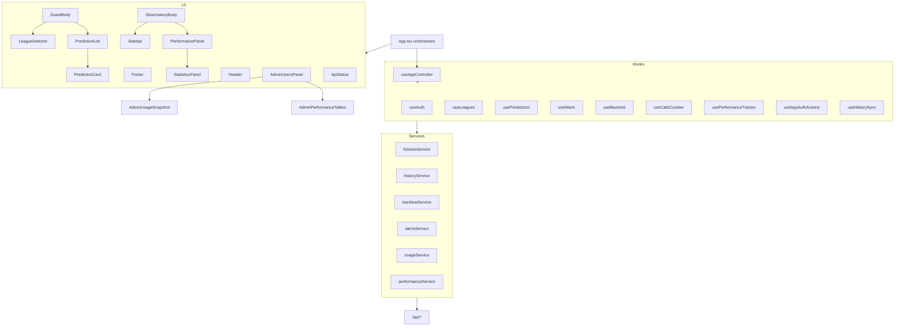

# Frontend App Architecture Refactor

Branch: `refactor/frontend-app-architecture`  
Backup: `backup/pre-frontend-refactor-15287a3` · `src/App.tsx.backup-pre-refactor`

## Goal

Split the monolithic `src/App.tsx` (~1900 lines) into presentational components, hooks, and thin service wrappers **without** changing business logic, API behavior, prediction calculations, or UI markup/classes/text.

## Files created

### Layout
- `src/components/layout/Header.tsx` — guest header shell (brand + pulse + children slots)
- `src/components/layout/Footer.tsx` — mobile sticky Predict bar
- `src/components/layout/GuestHeaderControls.tsx` — guest auth + date/warm/predict toolbar
- `src/components/layout/GuestBody.tsx` — guest leagues + prediction grid
- `src/components/layout/ObservatoryBody.tsx` — observatory performance + sidebar + dossier

### Sidebar / panels / cards
- `src/components/sidebar/Sidebar.tsx`
- `src/components/panels/LeagueSelector.tsx`
- `src/components/panels/StatisticsPanel.tsx`
- `src/components/panels/PerformancePanel.tsx`
- `src/components/panels/ApiStatus.tsx`
- `src/components/panels/BacktestPanel.tsx`
- `src/components/panels/AdminUsersPanel.tsx`
- `src/components/panels/AdminUsersTable.tsx`
- `src/components/panels/AdminUsageSnapshot.tsx`
- `src/components/panels/AdminPerformanceTables.tsx`
- `src/components/cards/PredictionCard.tsx`
- `src/components/cards/PredictionList.tsx`
- `src/components/cards/CallsCounter.tsx`
- `src/components/cards/DatePicker.tsx`

### Hooks
- `src/hooks/usePredictions.ts`
- `src/hooks/useWarm.ts`
- `src/hooks/useLeagues.ts`
- `src/hooks/useBacktest.ts`
- `src/hooks/useCallsCounter.ts`
- `src/hooks/usePerformanceTracker.ts` — win-rate animation + counter derived stats
- `src/hooks/useAppAuthActions.ts` — login/signup/logout/admin handlers
- `src/hooks/useAppController.ts` — composes dashboard hooks/effects into a single view-model for `App.tsx`

### Services
- `src/services/fixturesService.ts`
- `src/services/historyService.ts`
- `src/services/backtestService.ts`
- `src/services/alertsService.ts`
- `src/services/usageService.ts`
- `src/services/performanceService.ts`

### Types
- `src/types/index.ts` — re-exports `src/types.ts` + view-model helpers

### Docs
- `REFACTOR_REPORT.md` (this file)

## Files modified

- `src/App.tsx` — thin presentational orchestrator (**~153 lines**): consumes `useAppController` + layout/panels; same runtime behavior

## Intentionally unchanged

- `api/` folder
- `src/types.ts` (kept for existing imports)
- Prediction/math logic, endpoint URLs, and visual design tokens/classes

## Architecture

## Verification

- `npm run build` — **passes** (Vite production build)

## Line-budget check

- Extracted UI components under `layout/`, `panels/`, `cards/`, `sidebar/`: **all ≤ 250 lines**
- `App.tsx`: **~153 lines**
- Hooks may exceed 250 (orchestration), by design

## Future recommendations

1. Split `useAppController` into `useHistoryLifecycle` + `useAdminWorkspace` for easier testing.
2. Add unit tests for filter/sort in `usePredictions` and threshold normalization in `useBacktest`.
3. Route-level code splitting for admin-only panels (`AdminUsersPanel`, `BacktestPanel`).
4. Gradually migrate imports from `src/types.ts` → `src/types/` barrel.
5. If props drilling grows, add a small React context for observatory shell state (dates/leagues/auth) without moving fetch logic into context.
6. Apply the same extraction pattern to `UserDashboard.tsx` (~1060 lines).
