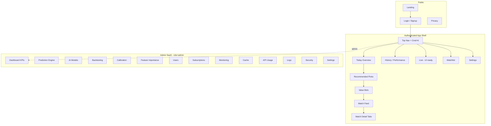
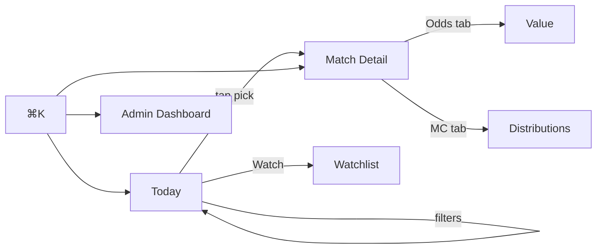

# UI / UX Masterplan — Footy Predictor Pro V3

**Date:** 2026-07-18  
**Panel:** Apple Product Design · SofaScore UX · Flashscore UI · Data Viz · Frontend Architecture · React  
**Constraint:** **Zero regression** of business logic, APIs, prediction engines, tier rules, admin ops. UX/IA/visual redesign only.  
**Companion docs:** `DESIGN_SYSTEM.md` · `COMPONENT_LIBRARY.md` · `ADMIN_DASHBOARD_V3.md` · `USER_EXPERIENCE_V3.md` · `FEATURE_ROADMAP_UI.md`

---

## 1. Mission

Make the first impression: **“This feels like a premium product.”**

Not a denser lab. Not more widgets. A **sports-intelligence platform** that scans like SofaScore/Flashscore, explains like a modern SaaS, and never breaks Warm → Predict → History → Admin.

---

## 2. Non-negotiables (preserve)

| Must keep | Current home | V3 home |
|-----------|--------------|---------|
| Auth / AuthGate / blocked | `RootRouter`, `useAuth` | Same contracts |
| Free / Premium / Ultra masking | `MatchCard`/`MatchModal` heuristics + server mask | Same rules, clearer lock UI |
| Warm + Predict | `UserDashboard` / `usePredictFlow` | Header quick action + command palette |
| League select / favorites | `LeaguePanel`, onboarding | Sticky filters + pinned competitions |
| Live scores | `useLiveFixtureScorePoll` | Match card LIVE chip + Live tab (UI shell) |
| Value / Confidence / FI / Contributions / MC / Lab / Explanation | Modal sections | Match detail **tabs** (same data) |
| Admin labs (Enterprise, Health, Model Lab, Backtest) | `PerformancePanel` stack | Admin nav sections (same services) |
| Admin users / tiers / trials | `AdminUsersPanel` | Admin → Users / Subscriptions |
| GDPR export, privacy, email consent | User prefs | Settings |
| Settled-markets filter, insufficient-data | Card logic | Same |
| Model audit / pipeline badges | Card + modal audit | Overview + Prediction tab |

**Forbidden:** Changing `api/*`, engines, cron, masking math, or removing markets.

---

## 3. Design philosophy (inspiration → pattern, not clone)

| Product | Steal this interaction |
|---------|------------------------|
| SofaScore / FotMob | Match-first feed, logos, kickoff, expandable detail |
| Flashscore / LiveScore | Dense-but-scannable lists, status chips, sticky filters |
| Bet365 / Betano | Clear pick + odds + value affordance (not casino chrome) |
| BetExplorer / Forebet / FootyStats / OddsPortal | Stats tabs, H2H, odds comparison layout |
| Apple Sports / HIG | Airy hierarchy, large type, restrained color |
| Material 3 / SaaS | Surfaces, navigation rail, command palette |

**Principles:** Large spacing · Typography first · Data second · Few colors · Cards · Rounded · Sticky filters · Fast scan · Animate only when useful.

---

## 4. Information architecture (V3)



### Primary user flow (≤2 clicks to value)

```
Open /workspace
  → Today Overview (default)
  → Tap Recommended Pick card
  → Match Detail · Prediction tab
```

---

## 5. Before → After (shell)

### Before (current)

```
┌─────────────────────────────────────────────────────────┐
│ Header / toolbar / status / (admin: users + labs stack) │
│ ┌──────────┐  ┌─────────────────────────────────────┐   │
│ │ Leagues  │  │ MatchCard  MatchCard  MatchCard     │   │
│ │ checklist│  │ (dense: labs, value, expl, FI…)     │   │
│ └──────────┘  └─────────────────────────────────────┘   │
│ Admin: Enterprise + Health + Model Lab + Backtest       │
│         (vertical kitchen-sink)                         │
└─────────────────────────────────────────────────────────┘
```

### After (V3)

```
┌─ Top Nav: Logo · Today · Live · Watchlist · History · Admin* · ⌘K · Theme · Bell ─┐
│ Sticky filters: Date · Leagues★ · Markets · Conf · EV · Search · Saved filters   │
├──────────────────────────────────────────────────────────────────────────────────┤
│ TODAY OVERVIEW                                                                   │
│  [KPI strip: 4 cards max]     [Continue where you left off]                      │
│  Recommended Picks (horizontal) · Value Bets (horizontal)                        │
│  Match Feed (clean cards)                                                        │
└──────────────────────────────────────────────────────────────────────────────────┘
* Admin → separate IA (ADMIN_DASHBOARD_V3.md)
```

---

## 6. Home — premium landing dashboard

**Route:** `/workspace` (default) or `/app/today`

| Block | Content | Data source (existing) |
|-------|---------|------------------------|
| Continue | Last opened match / last date | `localStorage` + recently viewed (new client store) |
| Overview KPIs | Matches today · Avg confidence · Value count · Hit rate | Predictions list + `SuccessRateTracker` |
| Recommended | Top picks by confidence | `recommended.confidence` sort |
| Highest EV | Top value | `valueEngine` / `valueBet` |
| Interesting | High entropy / adaptive MC score | `monteCarlo.adaptive.score` or close 1X2 |
| Favorite leagues | Pinned | Existing favorites |
| Recent performance | Mini sparkline | Tracker / history |
| Quick filters | Elite / favorites / value-only | Client filters |
| Search | Team / league / pick | Client + future smart search |
| Pinned competitions | Drag-reorder pins | Client prefs |

**Rule:** Max **4** KPI cards. No stacked lab widgets on Home.

---

## 7. Match card (redesign)

**Component:** evolve `MatchCard.tsx` → presentational `MatchCardV3` wrapping same `PredictionRow`.

```
┌──────────────────────────────────────────────────────────┐
│ 🏛 League            20:45          ● LIVE / OPEN / WIN │
│ ┌──┐ Home          vs          Away ┌──┐                │
│ └──┘                               └──┘                  │
│                                                          │
│  Pick: Over 2.5     [Conf 72]  [+EV]  [Risk ····]        │
│  ████████░░ 1   ████░░ X   ██████ 2                      │
│  spark: ▁▂▃▅▄  (prob trend or MC total goals)            │
│                                           [ Expand → ]   │
└──────────────────────────────────────────────────────────┘
```

**Show:** logos, competition, kickoff, confidence badge, recommended bet, value indicator, probability bars, small trend, expand.  
**Hide on card:** long explanation, full FI, full MC, lab radar (move to detail tabs).  
**Tier locks:** compact lock chips (same heuristics).

---

## 8. Match details (tabs)

**Component:** refactor `MatchModal` → full-page or drawer with tabs. **Same data props.**

| Tab | Maps from today |
|-----|-----------------|
| Overview | Header + pick + bars + teamContext |
| Prediction | Lab + explanation + contributions |
| Statistics | marketTiers, cards, derived markets |
| Team Form | standings + form ribbons |
| Head to Head | when available / placeholder |
| Odds | odds + marketOdds |
| Expected Goals | luckStats + XG bars + xgModel |
| Confidence | `ConfidenceEnginePanel` |
| Feature Importance | horizontal bars (`FeatureImportance` / Contributions) |
| Monte Carlo | charts only (`MonteCarloPanel`) |
| Value Bet | `ValueCard` + stake |
| Timeline | historical prediction changes (UI; data when present) |
| Live | reserved shell for future live preds |

---

## 9. Filters (sticky)

Sticky under nav:

`Date` · `★ Leagues` · `★ Teams` · `Market` · `Min Confidence` · `Min EV` · `Min Prob` · `Bookmarks` · `Saved filter ▾`

Persist per user (localStorage → later API). Does not change predict backend.

---

## 10. Live experience (UI-ready)

- Nav item **Live** with empty/premium empty-state.  
- Card LIVE chip already exists — keep polling.  
- Placeholder modules: “Live λ drift”, “In-play value” — disabled with “Coming soon”, no fake numbers.

---

## 11. Backtest → Analytics

Move kitchen-sink charts out of user Home. Admin/Analytics:

ROI · Yield · Profit · Drawdown · Sharpe · CLV · Monthly evolution — **interactive** (`BacktestCharts` upgraded visually, same `backtestService`).

---

## 12. Implementation phases (zero regression)

| Phase | Scope | Risk |
|-------|-------|------|
| **P0** | Design tokens + shell nav + sticky filters; MatchCard declutter (CSS/layout only) | Low |
| **P1** | Match Detail tabs (reorder existing panels) | Low |
| **P2** | Today Overview composition (client sort of existing preds) | Low |
| **P3** | Admin IA split (route panels, don’t rewrite services) | Med |
| **P4** | Placeholders: watchlist, cmd+K, theme, compare (local state) | Low |
| **P5** | Chart polish (MC, FI bars, backtest) | Low |

Each phase: visual QA + existing vitest/math tests green + smoke Warm/Predict/History/Admin.

---

## 13. Migration strategy

1. **Feature flag** `VITE_UX_V3=1` (or role-based admin preview).  
2. Keep `UserDashboard` / `App` paths until V3 shell feature-complete.  
3. Extract presentational components; **do not** move API calls.  
4. Map every Preserve row → acceptance test checklist.  
5. Cut over default shell when checklist = 100%.  
6. Deprecate vertical `PerformancePanel` stack in favor of admin nav (panels remain mounted behind routes).

---

## 14. Success metrics (UX)

| Metric | Target |
|--------|--------|
| Time to first recommended pick | &lt; 5s after predict |
| Clicks to match detail | ≤ 2 |
| Cards above fold (desktop) | ≥ 3 readable |
| Admin lab discoverability | ≤ 2 clicks from Admin |
| Regression: Warm/Predict/History | 100% pass |

---

## 15. Wireframe — navigation flow



---

**Next:** implement tokens (`DESIGN_SYSTEM.md`) → components (`COMPONENT_LIBRARY.md`) → user flows (`USER_EXPERIENCE_V3.md`) → admin (`ADMIN_DASHBOARD_V3.md`) → phased UI features (`FEATURE_ROADMAP_UI.md`).
