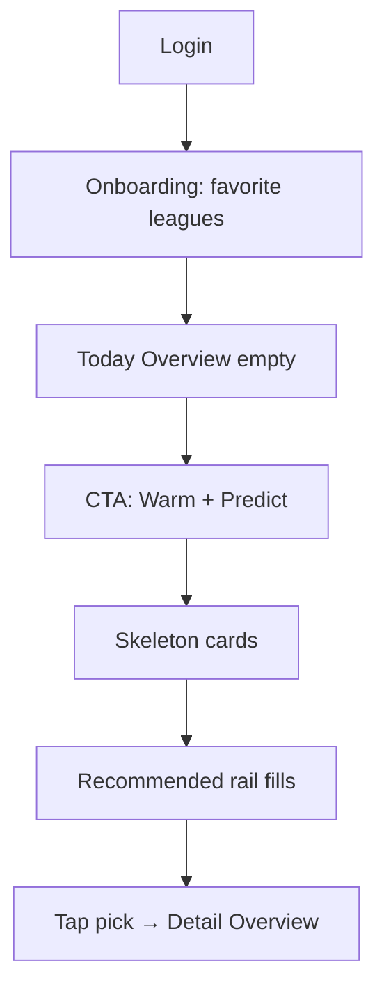

# User Experience V3

**Goal:** Fewest clicks to a trusted pick. Premium feel. Zero logic regression.  
**Shells:** Authenticated user (`UserDashboard` evolution) · Guest landing unchanged in spirit · Admin see Admin doc.

---

## 1. Experience principles

1. **Match-first** — like SofaScore, not spreadsheet-first.  
2. **Progressive disclosure** — card → tabs → audit.  
3. **Honest locks** — tier gates look intentional, not broken.  
4. **Speed perception** — skeletons + sticky context.  
5. **Continue continuity** — resume last match/date.

---

## 2. Personas & jobs

| Persona | Job to be done | Primary path |
|---------|----------------|--------------|
| Free scanner | See today’s picks, limited depth | Today → card → Overview |
| Premium analyst | Value + corners + categories | Today → Value rail → Odds/Value tabs |
| Ultra power | Full MC/FI/Lab/special | Detail all tabs |
| Returning user | Continue + watchlist | Continue strip → Watchlist |

---

## 3. End-to-end flows

### 3.1 First session (post-login)



**Preserve:** existing onboarding + notification prefs + GDPR consent.

### 3.2 Daily ritual (returning)

```
Open app
 → Continue where you left off (chip)
 → Glance Recommended (horizontal)
 → Glance Value (horizontal)
 → Scroll Matches OR filter ★ leagues
 → Expand match → Prediction / Value tabs
 → Star to Watchlist
```

### 3.3 Predict action

- Primary CTA in TopNav + floating on mobile.  
- Warm as secondary.  
- Status in toast + aria-live (keep current messages).  
- Free DB-mode badge retained when applicable.

### 3.4 History / performance

- Nav **History**: win/loss/pending, league breakdown (`PerformanceCounterModal` / tracker).  
- Settled-markets toggle retained.  
- Not mixed into Today clutter.

---

## 4. Screen-by-screen UX

### 4.1 Today Overview

**Above fold:**  
1. Greeting + date  
2. 4 KPIs max  
3. Continue chip  
4. Recommended picks (horizontal scroll)  
5. Value bets (horizontal)

**Below:** Match feed + sticky filters.

### 4.2 Match feed

Clean `MatchCardV3` grid (1 col mobile · 2 tablet · 2–3 desktop).  
Click anywhere on card → Detail. Expand affordance optional.

### 4.3 Match Detail

Tab bar sticky under header. Default tab **Overview**.  
Remember last tab per session.

**Confidence explanation:** Overview module “Why this confidence” → opens Confidence tab (same `confidenceEngine` data).

**Match difficulty indicator:** derived UI from entropy / favorite gap / adaptive MC score — display only.

**Betting risk meter:** display only from conf + EV + tier — not a new model.

### 4.4 Watchlist / Favorites

Client-side lists (localStorage keyed by user id) until backend exists:

- Favorite matches (fixture ids)  
- Favorite teams  
- Favorite leagues (already exists — unify UX)

### 4.5 Live

Empty state + LIVE matches filter when `status` live. Future live preds: dashed modules.

### 4.6 Settings

Theme · Notifications · GDPR export · Trials · Favorite leagues — migrate from UserDashboard prefs clutter.

---

## 5. Tier UX (preserve rules, improve clarity)

| Tier | Card shows | Detail |
|------|------------|--------|
| Free | Pick, locked conf, limited bars | Locks for corners/shots/HT/edge; upgrade CTA |
| Premium | Category conf, more markets | Shots/HT locked as today |
| Ultra | Exact conf, value, special bet | All tabs |

**Do not change** server mask or heuristics that detect free/premium/ultra shapes — only visual lock components.

---

## 6. Search & command palette

| Action | Example |
|--------|---------|
| Go to match | “Arsenal” |
| Filter league | “Premier League” |
| Run Predict | “Predict” |
| Open History | “History” |
| Theme | “Dark mode” |
| Admin | “Monitoring” (admin only) |

Shortcut: Ctrl/Cmd+K.

---

## 7. Notifications center (UI)

Bell drawer:

- Prediction settled  
- Value alert (pref-based)  
- Daily digest placeholder  
- System (trial ending)

Wire to existing notification prefs; items can be local stubs until push exists.

---

## 8. Compare flows (UI-only)

1. **Compare two matches** — select A/B from feed → split view Overview metrics.  
2. **Compare two models** — admin Models page already; user-facing: show active model badge + “Compare models” → read-only Model Lab if entitled, else upgrade.

---

## 9. Micro-copy guidelines

- Labels short: “Value”, “Conf”, “Live”.  
- Errors actionable: “Predict failed — retry Warm”.  
- Locks: “Available on Premium” not “Error”.  
- Romanian primary OK; keep consistency per screen (avoid mid-card language flips long-term → i18n later).

---

## 10. Responsive behavior

| Breakpoint | Behavior |
|------------|----------|
| ≥1280 | Nav + filters + 2–3 col feed |
| 768–1279 | Collapsible nav · 2 col |
| &lt;768 | Bottom tab bar: Today · Live · Watch · History · More · filters as sheet |

Nothing overflows: `min-w-0`, truncating team names, horizontal rails with snap.

---

## 11. Accessibility UX

- Tab list arrow keys  
- Card focus ring  
- Chart text alternative  
- Reduced motion  
- Theme including high contrast  

---

## 12. Wireframes

### Today (mobile)

```
┌─────────────────────┐
│ Footy ▾    ⌘  ☾  🔔 │
│ Today · Live · Watch│
├─────────────────────┤
│ Filters [sheet]     │
│ KPI KPI KPI KPI     │
│ Continue: ARS-CHE → │
│ Recommended →→→     │
│ Value →→→           │
│ ┌ MatchCard ──────┐ │
│ └─────────────────┘ │
│ ┌ MatchCard ──────┐ │
│ └─────────────────┘ │
├─────────────────────┤
│ Today Live Watch …  │
└─────────────────────┘
```

### Detail tabs (desktop)

```
┌ Header: logos · score · pick · conf · odd     [★] [Compare] ┐
├ Overview │ Prediction │ Stats │ Form │ H2H │ Odds │ xG │ … ┤
│                                                             │
│  Tab content (one panel group)                              │
└─────────────────────────────────────────────────────────────┘
```

---

## 13. Acceptance (user)

- [ ] Warm + Predict still works  
- [ ] Favorites/leagues persist  
- [ ] History tracker intact  
- [ ] Live poll intact  
- [ ] All modal sections reachable via tabs  
- [ ] Tier locks still correct  
- [ ] Trials / GDPR / notifications reachable in Settings  
- [ ] ≤2 clicks from Today to a pick detail  

---

## 14. Mapping from current UserDashboard

| Current block | V3 destination |
|---------------|----------------|
| Performance strip | History + small Today KPI |
| Header tier / DB chip | TopNav |
| Date + Warm/Predict | Sticky filters + TopNav CTA |
| Trials / prefs / GDPR | Settings |
| LeaguePanel | Sticky filters + Pins |
| MatchCard grid | Match feed |
| MatchModal | Match Detail tabs |
